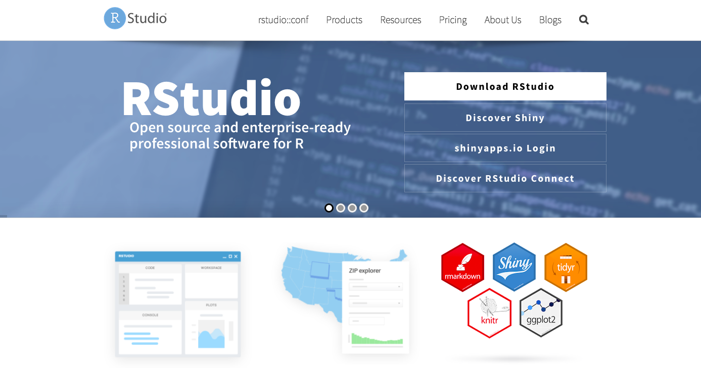
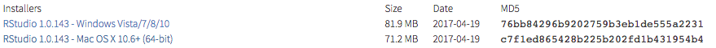

# Installing R and RStudio

In this section, we will learn how to install R and RStudio. Both are freely available online.

## Downloading and Installing R

**Description**

R is an open source programming language designed for statistical computing and visualization. Scientists and data analysts worldwide use it for purposes ranging from regression analysis, to natural language processing, to biological simulation, to social network analysis - the topic of this class. Being open source, users from around the world add new functions to its repositories on a daily basis. This means that the possible tools you can use and analyses you can perform with R are expanding constantly, making it an increasingly powerful environment for statistical analysis. We will show you just a glimpse of this power, but hopefully we can provide enough of a basis for you to go out on your own and learn more. 

**Steps**

Navigate to https://www.r-project.org/

******

******

Click on the blue, bolded "download R" in the first paragraph.

******

******

Choose a mirror (in other words, a website hosting current and past R distributions) located somewhere near to you. I am based in New York so I chose one based out of Carnegie Mellon in Pennsylvania. 

******

******

Download R by clicking on one of the "Download R for" links. Choose the link that accords with your operating system. I am using Mac, so I clicked: "Download R for (Mac) OS X"

******

******

Next click the first link underneath the "Files" heading. This should begin the download.

******

******

Follow the instructions on the installer that begins when you click on the downloaded file. Once you are finished, R should be installed on your system.

******

******

## Downloading and Installing RStudio

**Description**

Next we need to install RStudio. RStudio is a user interface for R, which greatly improves the experience of working in R. As stated on its website, some of its features include:

- Customizable workbench with all of the tools required to work with R in one
place (console, source, plots, workspace, help, history, etc.).
- Syntax highlighting editor with code completion.
- Execute code directly from the source editor (line, selection, or file).
- Full support for authoring Sweave and TeX documents.
- Runs on all major platforms (Windows, Mac, and Linux) and can also be
run as a server, enabling multiple users to access the RStudio IDE using
a web browser.

**Steps**

To download RStudio, navigate to https://www.rstudio.com/ and click the download RStudio button: 

******

******

Scroll down and click on the green "Download" button in the RStudio Desktop column. RStudio is free!

******

******

This should cause your browser to scroll down to the bottom of the page where you will see a series of blue installers. 

******

******

Click the installer (*not* Zip/Tarball!) according to your operating system. This should prompt a download.

******

******

Double click on the downloaded file, which will begin the installation process. If you are on Mac OS X, drag RStudio to your Applications folder. 

******

******

Now you are all set to go for the tutorial! Find RStudio wherever you saved it (Applications folder if you are on Mac), and open it. In the next chapter, we will learn what to do once it is up and running.