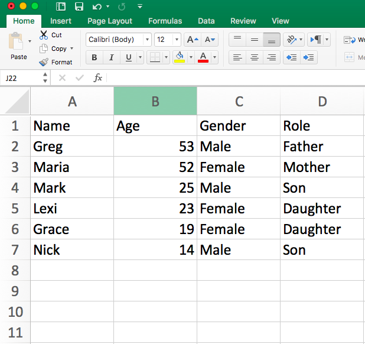

# Network Visualization and Aesthetics

As social scientists, we want to tell convincing stories about the structure and dynamics of the networks we study. Visualization and statistics are the primary tools at our disposable for conveying these stories. 

In this tutorial we will learn how to change the aesthetics of our network visualizations. When visualizing networks, there are a number of different elements we can adjust. First, we can change the color, size, shapes and labels of nodes. Second, we can change the color, width, curviture and appearance of edges. We can highlight the location of different groups in the network. Finally, we can manipulate the overall layout of the network. 

## The Basics

Let's start by adjusting the basic visualization. First, load in the data we created in the last tutorial and graph it as a network. The code below should look familiar. The only difference is that I converted money_edgelist into a matrix in the same line as graphing it as an edgelist. This is called nesting functions. There is no limit to the amount of functions you can have nested, though often times it is easier to read if you break them up into multiple lines.

```{r}
library(igraph)
money_edgelist <- read.csv("data/money_edgelist.csv", stringsAsFactors = F)
moneyNetwork <- graph.edgelist(as.matrix(money_edgelist), directed=TRUE)
```

Visualizing the network is as simple as typing plot(moneyNetwork). But as I mentioned earlier, the default plot is really horrible (and it used to be worse...). We can adjust the settings of the plot so that the resulting visualization is more aesthetically pleasing. There are many settings for the igraph plot() function, and we will go over the bare minimum you need to start making decent visualizations on your own. 

```{r}
plot(moneyNetwork)
```

The most basic things we can change are the sizes and colors of nodes. When your network is large, often the nodes will appear too large and clumped together. The argument vertex.size allows you to adjust node size (vertex is the graph-theory term for node!).

```{r}
plot(moneyNetwork, vertex.size = 10)
```

This is the basic way you change the settings of the plot function in igraph - you put a comma next to the next to the network object, type the name of the setting you want to change, and set it to a new value. Here we set vertex.size to 10. When you don't change any settings, R will automatically use the default settings. You can find them in the help section for that function (i.e. by typing ?plot.igraph, for example). All you have to do is remember the names of the various settings, or look them up at: http://igraph.org/r/

The nodes have an ugly light orange color... We can use vertex.color to change their color to something nicer. We can also remove the ugly black frames by changing the vertex.frame.color setting to NA.

> **Useful Link**
> You can find a list of all the named colors in R at http://www.stat.columbia.edu/~tzheng/files/Rcolor.pdf

```{r}
plot(moneyNetwork, vertex.size = 10, vertex.color = "tomato", vertex.frame.color = NA)
```

The labels are too large and blue. We can adjust label size with vertex.label.cex. We can adjust the color with vertex.label.color

```{r}
plot(moneyNetwork, vertex.size = 10, vertex.color = "tomato", vertex.frame.color = NA, vertex.label.cex = .7, vertex.label.color = "black")
```

Alternatively, if we want to get rid of the labels, we can just set vertex.label to NA.

```{r}
plot(moneyNetwork, vertex.size = 10, vertex.color = "tomato", vertex.frame.color = NA, vertex.label = NA)
```

Finally we can make the edges smaller and curved to give them a nicer aesthetic

```{r}
plot(moneyNetwork, vertex.size = 10, vertex.color = "tomato", vertex.frame.color = NA, vertex.label.cex = .7,  vertex.label = NA, edge.curved = .1, edge.arrow.size = .3, edge.width = .7)
```

But don't go too crazy! If you set edge.curved to be greater than .1, it will start to look like spaghetti. 

```{r}
plot(moneyNetwork, vertex.size = 10, vertex.color = "tomato", vertex.frame.color = NA, vertex.label.cex = .7,  vertex.label = NA, edge.curved = 1.7, edge.arrow.size = .3, edge.width = .7)
```

## Layouts

An essential part of a network visualization is its layout, which determines the nodes' positions in the plot. There are a wide range of layouts that have been developed for social network analysis.  They all try to minimize the number of edges that cross, but use different algorithms for achieving this goal. Generally, I use either the Kamada Kawai algorithm or the Fruchterman Reingold algorithm. 

igraph has set of layout functions which, when passed a network object, return an array of coordinates that can then used when plotting that network. These coordinates should be saved to a separate R object, which is then called within the plot function. They all have the format: layout DOT algorithm name.  For example, layout.kamada.kawai() or layout.fruchterman.reingold()

**Kamada Kawai**

```{r}
# first we run the layout function on our graph
kamadaLayout <- layout.kamada.kawai(moneyNetwork)

# and then we change the default layout setting to equal the layout we generated above
plot(moneyNetwork, layout = kamadaLayout, vertex.size = 10, vertex.color = "tomato", vertex.frame.color = NA, vertex.label.cex = .7,  vertex.label = NA, edge.curved = .1, edge.arrow.size = .3, edge.width = .7)
```

**Frucherman-Reingold**

```{r}
# first we run the layout function on our graph
fruchtermanLayout <- layout.fruchterman.reingold(moneyNetwork)

# and then we change the default layout setting to equal the layout we generated above
plot(moneyNetwork, layout = fruchtermanLayout, vertex.size = 10, vertex.color = "tomato", vertex.frame.color = NA, vertex.label.cex = .7, vertex.label = NA, edge.curved = .1, edge.arrow.size = .3, edge.width = .7)
```

You can see ?layout_ for more options and details.


## Adding attributes to a network object

We can affect any of these aesthetics arbitrarily. You might prefer the way networks look when the edges are curved as opposed to straight for example. However, we often make decisions informed by theories we have about our empirical setting. If we think that race is important to the structure of the network, we might color nodes according to race. If we think both race and gender are important, we could color nodes by race and change the shape of nodes by gender. We could also size nodes according to wealth. We are generally limited to visualizing three attributes of nodes at once (using color, shape and size), though I find that anything more than two (color and size) is difficult to interpret. 

It follows that, to visualize how attributes are distributed over the nodes of the network, most network projects need two separate datasets. In addition to creating and loading a dataset of relations, which we covered in the previous tutorial, we need a second dataset that details actors' attributes and we need to add the data to our network. Deciding wich attributes are relevant will depend on the domain and your research question; if you are studying gangs in the southside Chicago, you might record actors' gang affiliations and residence; if you are interested in the business relationships between Saudi elites, you might record their age and lineage. 

Let's return to Excel and build an attribute dataset for our network. This kind of dataset is much more traditional: each row is a person (otherwise known as an observation) and each column accords with some attribute you measured for that person. Here is a picture of an example attribute dataset I made for my family's money provision network. 

**Hoffman family attributes**

******



******

I saved this attribute dataset as a .csv file inside of my R directory. I will load it into R, just as I did the edgelist in the previous tutorial (all of this should be practiced and familiar! if not, revisit the previous tutorial).

```{r}
attributes <- read.csv("data/attribute_df.csv", stringsAsFactors = F)
head(attributes)
```

This gives us a data.frame, where each row corresponds to a person and each column corresponds to one attribute of the people in our network, but to use these attributes in igraph, we have to assign them to the nodes in the igraph object (moneyNetwork, that is). 

Attributes in igraph are assigned to nodes and edges separately. As mentioned in the previous tutorial, vertices are accessed using the V() function while edges are accessed with the E() function. Attributes are then accessed with the dollar sign operator followed by the attribute name. For example, as we showed earlier, V(countrysideNetwork)$name will tell us the names of all of the nodes in the network. To change an attribute, we can just use the equals sign to set them equal to something else. So for example, here I change the names of the nodes in my network 

```{r}
# Change the names
V(moneyNetwork)$name = c("Bob", "Linda", "Elias", "Catherine", "Eloise", "Pumpkin")

# Print the node names to see that it worked!
print(V(moneyNetwork)$name)
```

At the moment, our network doesn't have any attributes other than name. If we try to look at the sex of our nodes, we will get NULL as a result. 

```{r}
V(moneyNetwork)$gender[1:6]
```

We therefore need to attach the attributes from our attribute file to our network. The method for doing can be a bit complicated.

If we have an edge list, we can use the \graph_from_data_frame() function instead of graph.edgelist(), and  include the attributes file as the vertices argument. For whatever reason, in this case, the edge list needs to be a data.frame, so no need to convert it to a matrix. Also, it is important to note that igraph _assumes_ that the first column is the name column, so make sure that is the case!

```{r}
# Load in the edge list again
money_edgelist <- read.csv("data/money_edgelist.csv", stringsAsFactors = F)

# Load in the attributes again
attributes <- read.csv("data/attribute_df.csv", stringsAsFactors = F)

# Put them both in the network.
moneyNetwork <- graph_from_data_frame(money_edgelist, directed = T, vertices = attributes)
```

Now, if we look at our network, we will see that there are many more next to attr. 

```{r}
moneyNetwork
```

We can look at each one with the V()$ function. For example, here is gender.

```{r}
V(moneyNetwork)$Gender 
```

Awesome! Now the attributes are in the network. 

## Plotting based on attributes

In the last section, we imported attributal data into our network object, which will allow us to manipulate our network according to nodal attributes. Let's start by manipulating color according to gender 

To do this we have to assign colors to people according to their sex. We use the ifelse function. The ifelse() function takes three arguments. The first is a test (something that evaluates to TRUE or FALSE), the second is what to return if the test is TRUE and third is what to return if the test is FALSE. 

We therefore set up an ifelse function, which tests whether a node's gender is male, assigning it the color "blue" if TRUE (i.e. if they are a male) and "green" if FALSE (i.e. otherwise/they are a female). Remember that R is case sensitive, so if your gender variable contains "Males" and "Females", then make sure you put Male or Female (capitalized) in the ifelse statement.

```{r}
V(moneyNetwork)$color <- ifelse(V(moneyNetwork)$Gender == "Male", "dodgerblue3","seagreen")
```

Now we can replot the network. This time a node's color will be green or blue depending on their gender. Notice that I didn't set the vertex.colors inside the plot function this time, since doing so would override the colors we just gave the nodes. 

```{r}
plot(moneyNetwork, vertex.size = 10, vertex.frame.color = "black", vertex.label.cex = .7, vertex.label = NA, edge.curved = .1, edge.arrow.size = .3)
```

Now let's try role. First, I reset color. There are four roles (Father, Mother, Son, Daughter), so we need a few more ifelse statements to code for all of them.
```{r}
V(moneyNetwork)$color <- NA
V(moneyNetwork)$color <- ifelse(V(moneyNetwork)$Role == "Father", "burlywood1","tomato")
V(moneyNetwork)$color <- ifelse(V(moneyNetwork)$Role == "Mother", "seagreen", V(moneyNetwork)$color)
V(moneyNetwork)$color <- ifelse(V(moneyNetwork)$Role == "Son", "grey70", V(moneyNetwork)$color)

plot(moneyNetwork,vertex.size = 10, vertex.label.cex = .7, vertex.label = NA, edge.curved = .1, vertex.frame.color = "black", edge.arrow.size = .3, edge.width = .7, edge.color = "grey30")
```

Last but not least, let's adjust the sizes of the nodes so that they reflect differences in age. We can set node size to be 1/5th of the node's age with the code below. Simple, but effective. It looks like the oldest nodes give to the most people.

```{r}
V(moneyNetwork)$size = V(moneyNetwork)$Age/5

plot(moneyNetwork, vertex.label.cex = .7, vertex.label = NA, edge.curved = .1, vertex.frame.color = "black", edge.arrow.size = .3, edge.width = .7, edge.color = "grey30")
```
