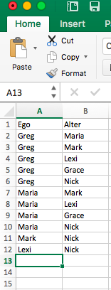
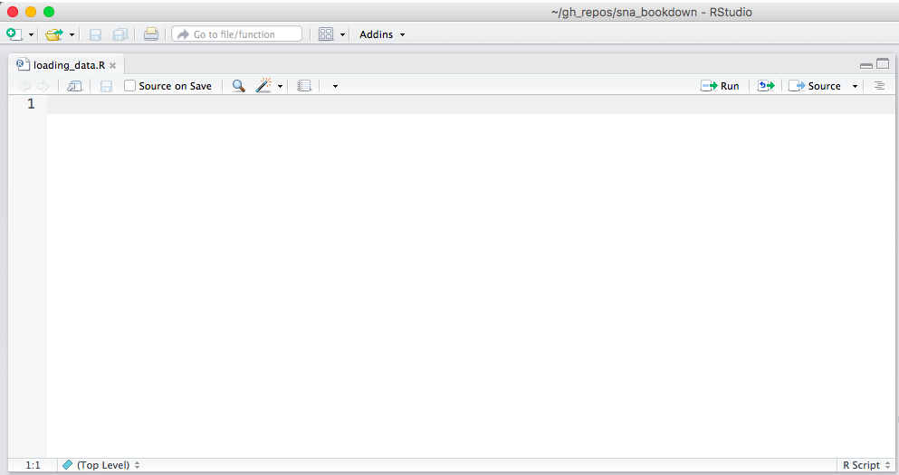

# Your First Network

In this chapter, we will create our own network data in Excel, learn to load the data into R, and the turn the data into a network object using the igraph package. You can use these steps to begin analyzing data from your own projects. 

## Creating a project

First let's create a new R project. RStudio projects allow you to keep your various data analysis projects separate from one another. Each project has its own working directory, workspace, history, and source documents. When you load a project, you will therefore see the work, history and files associated with that project, helping your organize your work. 

Go to the "File" menu at the top of the screen and click on "New Project..."

******


******

Then start a new directory. Directories are folders where you keep your R Project and all of the data, files, code etc. that you create and use in the project. 

******


******

Now start an empty project. Projects are created by RStudio and they maintain your R workspace for you, so that you can load it exactly as it was before you closed RStudio.  

******


******

Finally name your project (I named mine "SNA_Tutorial") and browse to find the location on your computer where you would like it to be saved. We will use this directory to store all of the files and information for the class, so make sure to choose a name you can remember. 

******


******

Now if you navigate to the folder of your new R Project (mine is on my Desktop in the folder titled "SNA Tutorial", for example), you will see the R Project there, symbolized by a blue glass cube with an R in it. If you ever want to re-open this project, you can double click on the cube. Alternatively, in RStudio you can go "File -> Open Project", navigate to the project's directory and open it from there.

******


******

This folder is where you should keep all of your data and R scripts for this project. Since we just created the project that we will use for the remainder of the tutorials, it is the best place for you to put all future class materials. 

## Creating data in Excel

Imagine you want to collect some data on your local social network. You might go to each of your friends and ask them to nominate up to five people who are their friends.  You then want to load this data into R and graph it as a network. How could you go about doing this?

The first step is to record the data in some machine-readable way, either using Excel or Numbers or even in plain text files. Many people, before coming to R, have experience using Excel or some program like it to manage data, whether financial, academic, or otherwise. An Excel worksheet is organized into rows and columns with columns generally containing information of a single kind (say First Names) and rows generally containing the data for a single observation. You can freely input data into any of the cells.

**An empty Excel spreadsheet**

******


******


The first step in any network analysis project is to create a dataset with the relationships between the people in your study. The easiest way to record relationships in Excel is as an edge list, which, as we discussed in the last section, is a two column matrix that lists the pairs of actors in a relationship.  

Let's build an edge list together in Excel. Imagine we want to track patterns of monetary provision in a household (i.e. whether person A gives person B money). We construct an edge list, where column A is the Ego (the money provider) and column B  is the Alter (the money taker). We then fill in instances, or relationships, of monetary provision from Ego to Alter. Below is an example:

**Money providing edge list (Hoffman family)**

******



******

Try recording something similar for your family!

## Saving Excel data as a .csv file

Great! Now we need to save this data in a format that R can easily read.  I generally use the .csv format, which separates values by commas, because R has a default function for reading .csv files. 

To save an Excel sheet as a .csv file, in Excel go to "File -> Save As..."

******


******


Then give your file a name (I chose "money_edgelist"), choose the place where you want to save it (inside of the directory you made for class), and finally (the most important part!), click on the "File Format" dropdown menu and choose "Comma Separated Values (.csv)". Click "Save"!

******


******

It will ask will warn you that the workbook contains features that will not work or may be removed if you save it in the selected file format and ask if you want to continue. Click "Continue".

******


******

Great! Now, inside of your class directory, you should see a new file titled "money_edgelist" (or whatever you chose to name it).  In the following section, we will learn how to read that edge list into R. 

## Loading data into R

Open up RStudio, make sure you are in your project for class (if not, go to "File -> Open Project", and selection your project), and open a new R Script by going "File -> New File -> R Script". Save the empty script and name it "loading_data.R". Your RStudio should look like this:

******



******

Now we will write our first line of code together. R has a simple function for loading .csv files: read.csv()
To use read.csv, we just tell R the name of the .csv file that we want it to read. It will then look inside the directory for that file. 

If it can't find the file - either because you typed the wrong name or you never dragged it to the directory - it will return the following error: 

> Error in file(file, "rt") : cannot open the connection
    In addition: Warning message:
    In file(file, "rt") :
      cannot open file 'money_edgelista.csv': No such file or directory

So sure money_edgelist.csv is in your directory or else the following lines of code won't work!

```{r}
money_edgelist = read.csv("money_edgelist.csv")
```

Now you should see in your Environment pane "money_edgelist" under the "Data" heading. That means you successfully loaded the data into R. 

******


******

You can click on it to see its contents or else run View(money_edgelist) in the console.

******


******

Cool! We now have our data loaded into R, ready to be turned into a network. 

## From data to networks

In this class, we will primarily use igraph, a user-maintained package in R, to analyze networks. Installing igraph gives us a bunch of new tools for graphing, analyzing and manipulating networks, that don't come with base R. The first step then is to install igraph. To install a new package, we use the install.packages() function. It takes a character argument that is the name of the package you wish to install.

```{r}
install.packages("igraph", repos='http://cran.us.r-project.org')
```

If you leave out the "repos" argument, it will cause a window to pop up with a list of CRAN mirrors. Then you can choose the repository nearest to you by double clicking on it. 

Now that igraph is installed, we need to use the library() function to load it into R.  You will have to do this every time you open RStudio or switch projects if you wish to make use of igraph's functions.

```{r}
library("igraph")
```

Great! Now we can use all of igraph's functions. To analyze networks, igraph uses an object class called: "igraph". We therefore have to convert our edge list, freshly loaded into R, into an igraph object. 

igraph only takes matrices, so we then have to convert our data.frame (the default class of objects returned by read.csv()) to a matrix.

```{r}
money_edgelist <- as.matrix(money_edgelist)
```

We can now turn the money_edgelist edge list into a network object. The required function is graph.edgelist() and it takes two arguments, the network data (an edge list) and whether the edges are directed or undirected.  In this case, because giving money is not necessarily a reciprocal relationship (i.e. just because I give you money, doesn't mean you necessarily give it back... in fact, the opposite is almost always the case!), the network should be directed. 

```{r}
moneyNetwork <- graph.edgelist(money_edgelist, directed=TRUE)
```
> **A Note on Function Documentation**
> If you want to see more about graph.edgelist() or if you want to see other ways to graph data type, you can type ?graph.edgelist. Entering ? before any function will cause R to bring up documentation on that function. 

Now we have two objects in our Environment, the money_edgelist and a new networked, called moneyNetwork. Both contain the same information at the moment, but igraph can only make use of the latter.

> **What if my data was in adjacency matrix format?**
> If your data was in adjacency matrix format, then you would use the graph.adjacency() function instead of the graph.edgelist() function. More about the graph.adjacency() function can be read in the function's help section accessed by typing ?graph.adjacency

## Exploring your network

We finally have a network in R! So.. what next? Well we can read a summary of it by typing its name into R.

```{r}
moneyNetwork
```

The first line - which begins with IGRAPH DN - tells us moneyNetwork is an igraph object and a directed network (DN), with N nodes and E edges.

The next line tells us some attributes of the nodes and edges network.  At the moment, it only has the attribute "name"  for the vertices (v/c). We can look at the values of the "name" attribute with the V()$ function.

```{r}
V(moneyNetwork)$name
```

Finally, the last part gives us a snapshot of the edges present in the network, most of which are omitted.  

We can visualize the network using the plot() function.

```{r}
plot(moneyNetwork)
```

The default visualization is pretty ugly... In the next section, we will learn how to improve the aesthetics of our network visualizations.