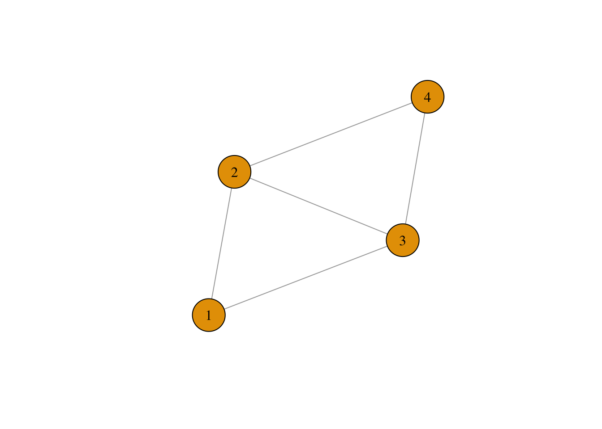
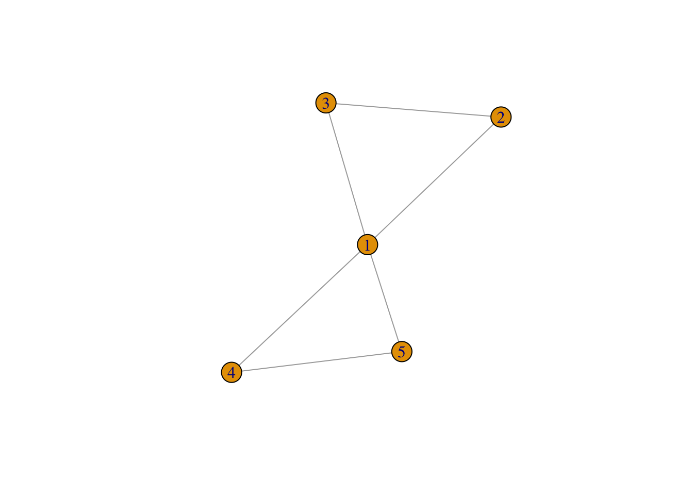
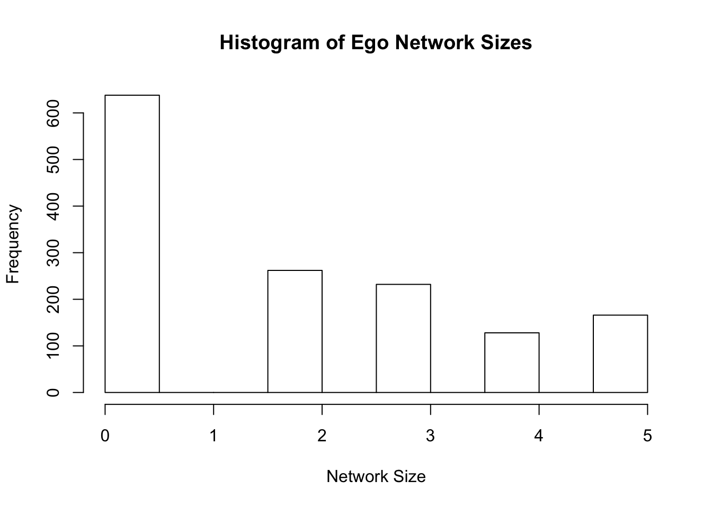
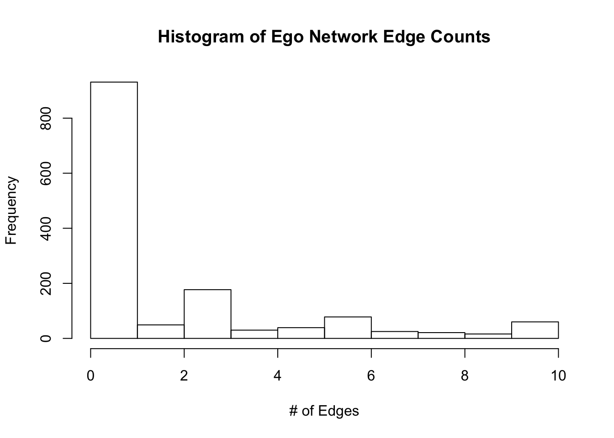
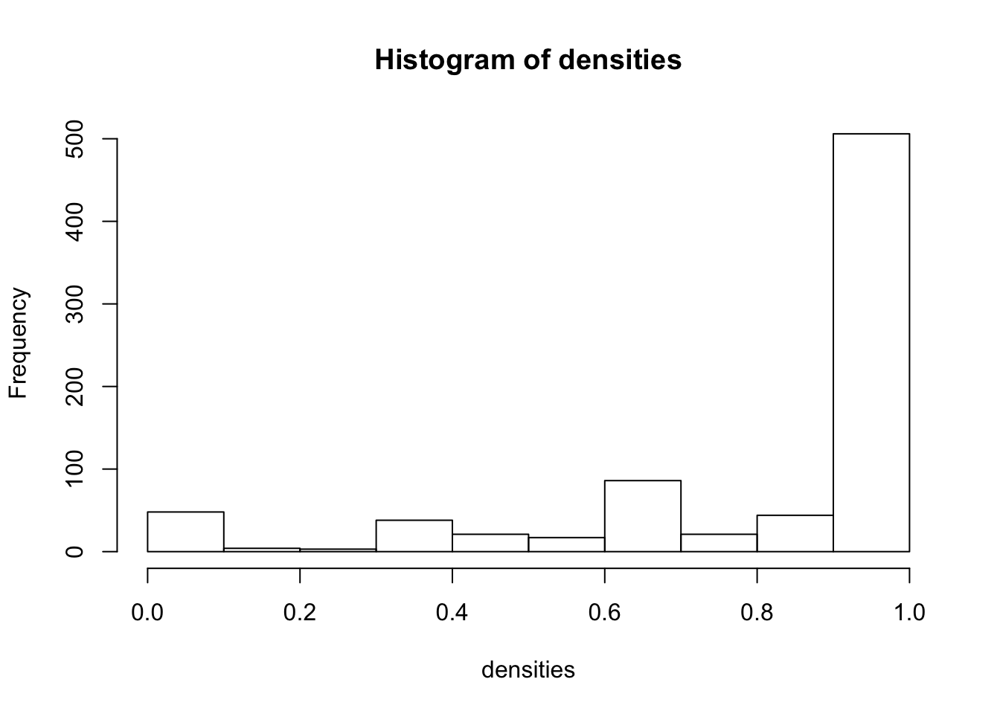

# Ego Networks

In this section, we analyze ego networks from the GSS network module in 2004. We will use the GSS data to become acquainted with measures of network density and heterogeneity. It will also teach us how to analyzing many networks all at once. In some cases, you might have hundreds of complete networks - for example, data about high schools often has networks from many different high schools. Since the schools are separate, you have to analyze them separately, but doing so one by one is laborious. Here we will learn about ego networks as well as strategies for apply the same function to many networks at once. 

We begin by reading in the data from the GSS network module, which I have included in the "Data" section of the materials for this class.  


```r
library(igraph)
```

```
## 
## Attaching package: 'igraph'
```

```
## The following objects are masked from 'package:stats':
## 
##     decompose, spectrum
```

```
## The following object is masked from 'package:base':
## 
##     union
```

```r
gss <- read.csv("Data/gss_local_nets.csv", stringsAsFactors = TRUE) 
```

Let's have a look at the data.  You can either click on it in your environment, type View(gss) or:


```r
head(gss)
```

```
##      sex  race age            partyid        relig numgiven close12 close13
## 1 female other  52        independent     catholic        0      NA      NA
## 2 female other  43 not str republican     catholic        0      NA      NA
## 3   male black  52    strong democrat   protestant        4       1       2
## 4 female other  34       ind,near dem     catholic        4       2       0
## 5   male other  22       ind,near dem moslem/islam        0      NA      NA
## 6   male black  26   not str democrat   protestant        6       0       2
##   close14 close15 close23 close24 close25 close34 close35 close45 sex1 sex2
## 1      NA      NA      NA      NA      NA      NA      NA      NA   NA   NA
## 2      NA      NA      NA      NA      NA      NA      NA      NA   NA   NA
## 3       0      NA       2       2      NA       1      NA      NA    1    1
## 4       2      NA       2       2      NA       2      NA      NA    1    0
## 5      NA      NA      NA      NA      NA      NA      NA      NA   NA   NA
## 6       1       1       1       1       1       2       2       2    1    1
##   sex3 sex4 sex5 race1 race2 race3 race4 race5 educ1     educ2     educ3
## 1   NA   NA   NA    NA    NA    NA    NA    NA    NA      <NA>      <NA>
## 2   NA   NA   NA    NA    NA    NA    NA    NA    NA      <NA>      <NA>
## 3    0    0   NA     1     1     1     1    NA     1 h.s. grad      Grad
## 4    1    1   NA     2     2     2     2    NA     1 h.s. grad      Grad
## 5   NA   NA   NA    NA    NA    NA    NA    NA    NA      <NA>      <NA>
## 6    0    1    1     0     1     1     2     2     1 h.s. grad h.s. grad
##          educ4        educ5 age1 age2 age3 age4 age5     relig1     relig2
## 1         <NA>         <NA>   NA   NA   NA   NA   NA       <NA>       <NA>
## 2         <NA>         <NA>   NA   NA   NA   NA   NA       <NA>       <NA>
## 3    Bachelors         <NA>   56   40   58   59   NA protestant protestant
## 4         Grad         <NA>   63   36   34   36   NA   catholic   catholic
## 5         <NA>         <NA>   NA   NA   NA   NA   NA       <NA>       <NA>
## 6 Some College Some College   25   25   39   33   30      other      other
##       relig3     relig4   relig5
## 1       <NA>       <NA>     <NA>
## 2       <NA>       <NA>     <NA>
## 3 protestant protestant     <NA>
## 4   catholic   catholic     <NA>
## 5       <NA>       <NA>     <NA>
## 6   catholic   catholic catholic
```

There are 42 variables.  The first five concern the attributes of a given respondent: their sex, age, race, partyid and religion. The next 36 make up the "network" part of the GSS Network Module. The structure can be a bit confusing, especially if you haven't read any papers that use this data. The basic idea of the module was to ask people about up to five others with whom they discussed "important matters" in the past six months.  The respondents reported the number of people whom they discussed "important matters": which is the variable "numgiven" in our dataset. They were also asked to detail the relations between those five people: whether they were especially close, knew each other, or were total strangers. This accords to the close variables in the dataset, where, for example, close12 is the closeness of person 1 to person 2, for each respondent. Finally they were asked about the attributes of each of the up to five people in their ego network (sex, race, age).

To see why these are called ego networks, let's take a respondent and graph the relations of the up to five people they said they discussed "important matters" with.  To do so, we have to first turn the variables close12 through close45 into an edge list, one for each respondent. 

This requires a tricky bit of code.
First we use grepl to extract the columns we want. grep basically uses string matching, so it looks through the column names and identifies those with the word "close" in them (look here for more information: https://www.regular-expressions.info/rlanguage.html)


```r
ties <- gss[,grepl("close", colnames(gss))]
head(ties)
```

```
##   close12 close13 close14 close15 close23 close24 close25 close34 close35
## 1      NA      NA      NA      NA      NA      NA      NA      NA      NA
## 2      NA      NA      NA      NA      NA      NA      NA      NA      NA
## 3       1       2       0      NA       2       2      NA       1      NA
## 4       2       0       2      NA       2       2      NA       2      NA
## 5      NA      NA      NA      NA      NA      NA      NA      NA      NA
## 6       0       2       1       1       1       1       1       2       2
##   close45
## 1      NA
## 2      NA
## 3      NA
## 4      NA
## 5      NA
## 6       2
```

As an example of what we will do for each respondent, let's first make a matrix, which we can fill in with the closeness values for a given respondent. 


```r
mat = matrix(nrow = 5, ncol = 5)
```

As it turns out, we can assign a person's close values directly to the lower triangle of the matrix. Here we do it for respondent 3.


```r
mat[lower.tri(mat)] <- as.numeric(ties[3,])
```

And we can symmetrize the matrix since the relation here (closeness) is mutual (i.e. the relation is undirected).


```r
mat[upper.tri(mat)] = t(mat)[upper.tri(mat)]
mat
```

```
##      [,1] [,2] [,3] [,4] [,5]
## [1,]   NA    1    2    0   NA
## [2,]    1   NA    2    2   NA
## [3,]    2    2   NA    1   NA
## [4,]    0    2    1   NA   NA
## [5,]   NA   NA   NA   NA   NA
```
Nice! 
Now let's drop any of the respondents who are missing. 


```r
na_vals <- is.na(mat)
non_missing_rows <- rowSums(na_vals) < nrow(mat)
mat <- mat[non_missing_rows,non_missing_rows]
```

And set the diagonal to zero, since NAs give igraph trouble


```r
diag(mat) <- 0
```

How does it look? Perfectly symmetrical, like all undirected graphs should be!


```r
mat
```

```
##      [,1] [,2] [,3] [,4]
## [1,]    0    1    2    0
## [2,]    1    0    2    2
## [3,]    2    2    0    1
## [4,]    0    2    1    0
```

Great! We can use this matrix to creat a network for a single respondent, like we did in the last tutorial but this time using the graph.adjacency function since our input data is a matrix. We will specify that we want it to be undirected and weighted.

```r
ego_net <- graph.adjacency(mat, mode = "undirected", weighted = T)
```

How does it look?

```r
plot(ego_net, vertex.size = 30, vertex.label.color = "black", vertex.label.cex = 1)
```



Cool.. the only problem is that we have to do this for every row in the dataset... what should we do? 
One option is to create a function, which uses the code above to turn any row in the ties data set into an ego network, and then apply that function to every row in the data. 
Below is such a function!


```r
make_ego_nets <- function(tie){
  # make the matrix
  mat = matrix(nrow = 5, ncol = 5)
  # assign the tie values to the lower triangle
  mat[lower.tri(mat)] <- as.numeric(tie)
  # symmetrize
  mat[upper.tri(mat)] = t(mat)[upper.tri(mat)]
  # identify missing values
  na_vals <- is.na(mat)
  # identify rows where all values are missing
  non_missing_rows <- rowSums(na_vals) < nrow(mat)
  
  # if any rows 
  if(sum(!non_missing_rows) > 0){
    mat <- mat[non_missing_rows,non_missing_rows]
  }
  diag(mat) <- 0
  ego_net <- graph.adjacency(mat, mode = "undirected", weighted = T)
  return(ego_net)
}
```

Now we can use lapply to loop through all of the rows in the data and apply the above function to each row. It will return a list of size nrow(ties), in which every item is an ego net of one of the respondents in the data. 

```r
ego_nets <- lapply(1:nrow(ties), 
                   FUN = function(x) make_ego_nets(ties[x,]))

head(ego_nets)
```

```
## [[1]]
## IGRAPH c68c5af U--- 0 0 -- 
## + edges from c68c5af:
## 
## [[2]]
## IGRAPH c44fea0 U--- 0 0 -- 
## + edges from c44fea0:
## 
## [[3]]
## IGRAPH 7c9ca61 U-W- 4 5 -- 
## + attr: weight (e/n)
## + edges from 7c9ca61:
## [1] 1--2 1--3 2--3 2--4 3--4
## 
## [[4]]
## IGRAPH ed00c44 U-W- 4 5 -- 
## + attr: weight (e/n)
## + edges from ed00c44:
## [1] 1--2 1--4 2--3 2--4 3--4
## 
## [[5]]
## IGRAPH 630d4d5 U--- 0 0 -- 
## + edges from 630d4d5:
## 
## [[6]]
## IGRAPH b0c7898 U-W- 5 9 -- 
## + attr: weight (e/n)
## + edges from b0c7898:
## [1] 1--3 1--4 1--5 2--3 2--4 2--5 3--4 3--5 4--5
```

Awesome! We have a whole list of networks. Let's take a look at a random network, say, the 1001st ego net.  


```r
random_ego_net <- ego_nets[[1021]]
plot(random_ego_net)
```



# Calculating Network Size and Density

Now that we have a list of networks, we can apply the same function to each network using a single line of code, again with the help of lapply. 
Network size is the number of nodes in a network. To find this, we use the vcount() function. We can also find the number of edges using ecount()

```r
network_sizes <- lapply(ego_nets, vcount)
network_edge_counts <- lapply(ego_nets, ecount)

head(network_sizes)
```

```
## [[1]]
## [1] 0
## 
## [[2]]
## [1] 0
## 
## [[3]]
## [1] 4
## 
## [[4]]
## [1] 4
## 
## [[5]]
## [1] 0
## 
## [[6]]
## [1] 5
```

We can take the mean of one of these results simply by turning the list into a vector and using the mean function on the resulting vector. 


```r
network_sizes <- unlist(network_sizes)
mean(network_sizes, na.rm = T)
```

```
## [1] 1.796634
```

The average network has a little over one and a half people in it. We could similarly plot the distribution. 


```r
hist(network_sizes, main = "Histogram of Ego Network Sizes", xlab = "Network Size")
```




And, naturally, we can do the same for edges. 

```r
network_edge_counts <- unlist(network_edge_counts)
hist(network_edge_counts, main = "Histogram of Ego Network Edge Counts", xlab = "# of Edges")
```



Finally, let's try density. Density captures how many edges there are in a network divided by the total possible number of edges. In an undirected network of size N, there will be  (N * (N-1))/2  possible edges. If you think back to the matrix underlying each network, N * N-1 refers to the number of rows (respondents) times the number of columns (respondents again) minus 1 so that the diagonal (i.e. ties to oneself) are excluded. We divide that number by 2 in the case of an undirected network only to account for that fact that the network is symmetrical. 

We could calculate this on our own for the random ego network from before as follows.

```r
ecount(random_ego_net)/((vcount(random_ego_net) * (vcount(random_ego_net) - 1))/2)
```

```
## [1] 0.6
```

igraph has its own function - graph.density which we can again apply to every ego network in the data. 

```r
densities <- lapply(ego_nets, graph.density)
densities <- unlist(densities)
```

To end the tutorial, let's plot the distribution of density across the different ego networks. 

```r
hist(densities)
```


