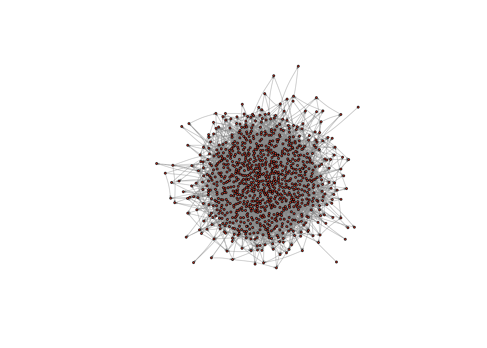
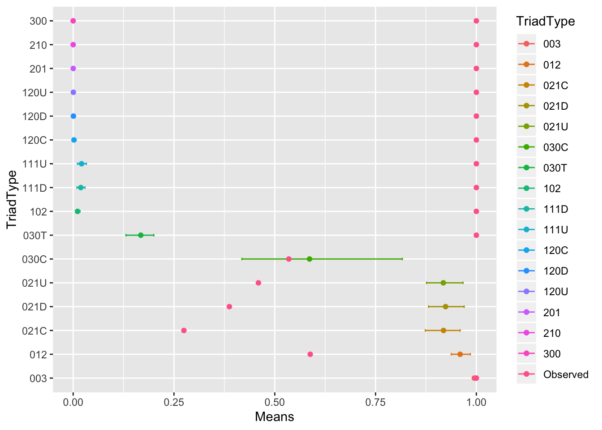

# Transitivity, structural, balance, and hierarchy

The main goal of this tutorial is to delve more deeply into the microfoundations of networks, such as dyads and tryads. We will learn the basic functions for measuring reciprocity, transitivity, the triad census, and for identifying cliques. We will also learn how to "ban" triads from a graph, and begin to think about whether our graphs deviate, in a statistical sense, from what we might expect by chance, one way of evaluating whether our results are "meaningful". 

Through this tutorial, we will rely on igraph to analyze the comm59 Add Health network that we made use of last class. For reference, below I show how that network can be constructed through downloading the data from the moreno.ss.uci website!


```r
# read in the edge list from moreno.ss.uci
el <- readLines("http://moreno.ss.uci.edu/comm59.dat")
```

```
## Warning in readLines("http://moreno.ss.uci.edu/comm59.dat"): incomplete final
## line found on 'http://moreno.ss.uci.edu/comm59.dat'
```

```r
# drop the unnecessary filler lines
el <- el[5:length(el)]
# split each line by space
el <- strsplit(el, " ")
# drop empty items in the lines
el <- lapply(el, function(x) subset(x, x != ""))
# bind it all together into a matrix
el <- do.call("rbind", el)

# Read in attributes from moreno.ss.uci
attributes <- readLines("http://moreno.ss.uci.edu/comm59_att.dat")
# drop the unnecessary filler lines
attributes <- attributes[12:length(attributes)]
# split each line by space
attributes <- strsplit(attributes, " ")
# drop empty items in the lines
attributes <- lapply(attributes, function(x) subset(x, x != ""))
# bind it all together into a matrix
attributes <- do.call("rbind", attributes)
# convert to a data.frame
attributes <- as.data.frame(attributes, stringsAsFactors = F)
# add the column names
colnames(attributes) = c("sex", "race", "grade", "school")
# add an ID column
attributes$ID <- 1:nrow(attributes)
```

Next let's graph it as a network, ignoring the ranking of friendships for now. 

```r
# First read in igraph
library(igraph)
```

```
## 
## Attaching package: 'igraph'
```

```
## The following objects are masked from 'package:stats':
## 
##     decompose, spectrum
```

```
## The following object is masked from 'package:base':
## 
##     union
```

```r
# Indexing data so that you only put in certain columns
el_no_weight <- el[,1:2] # We will ignore the ranking variable for now.

# Graph the network
net59 <- graph.edgelist(el_no_weight, directed = T)

# Finally, add attributes  
# First link vertex names to their place in the attribute dataset
linked_ids <- match(V(net59)$name, attributes$ID)

# Then we can use that to assign a variable to each user in the network
V(net59)$race <- attributes$race[linked_ids]
V(net59)$sex <- attributes$sex[linked_ids]
V(net59)$grade <- attributes$grade[linked_ids]
V(net59)$school <- attributes$school[linked_ids]

net59 # Great!
```

```
## IGRAPH b2bc741 DN-- 975 4160 -- 
## + attr: name (v/c), race (v/c), sex (v/c), grade (v/c), school (v/c)
## + edges from b2bc741 (vertex names):
##  [1] 1 ->191 1 ->245 1 ->272 1 ->413 1 ->447 3 ->21  3 ->221 3 ->480 3 ->495
## [10] 3 ->574 5 ->96  5 ->258 5 ->335 6 ->271 6 ->374 6 ->400 6 ->489 6 ->491
## [19] 6 ->573 6 ->586 7 ->134 7 ->159 7 ->464 7 ->478 8 ->221 8 ->284 8 ->378
## [28] 8 ->557 9 ->137 9 ->442 9 ->473 9 ->498 10->20  10->22  10->64  10->75 
## [37] 10->89  10->219 10->272 10->276 11->101 11->155 11->190 11->273 11->337
## [46] 11->339 11->353 11->616 12->188 12->475 14->20  14->151 14->597 15->106
## [55] 15->189 15->233 15->325 15->333 15->449 15->491 15->552 15->624 15->627
## [64] 16->30  16->201 16->217 16->267 16->268 16->466 16->569 17->625 19->45 
## + ... omitted several edges
```

## The Dyad

We can break large social networks down into their constituent parts. These constituent parts are referred to as "motifs". The most basic motif consists of two nodes and is called a dyad. Edges in a network signify the presence or absence of dyadic relations. It follows that a dyad in an undirected network can have two unique configurations: connected or disconnected; and three unique configurations in a directed network (mutual, assymetric, and null)

Density captures, at the macro-level, the proportion of dyads that are present over the possible total number of dyads in the network. We are simply re-framing what we discussed last class, except we are focusing on the configuration of nodes as opposed to edges.


```r
graph.density(net59)
```

```
## [1] 0.004380561
```

A related concept is that of reciprocity, a measure which pertains only to directed graphs. Reciprocity is the tendency with which affect, or network ties, sent out by egos are returned by alters. Edges are reciprocal when ego and alter both send each other ties; reciprocity is the graph-level analogue, evaluating the tendency for edges to be reciprocal across the whole network. 


```r
reciprocity(net59)
```

```
## [1] 0.39375
```

So our graph has a reciprocity score of 0.39. Is that high or low? It depends on your expectation. If you are from a society with a strong taboo against unrequited affect, then it might seem low. If you come from an individualistic society, it might seem high. 

## Generating a random graph for comparison
One way network scholars evaluate whether a given descriptive statistic is high or low is to compare it to the value that obtains under a random network of similar density. In random graphs, the chance that any two dyads are in a relation is determined by chance (i.e. the flip of a coin). This means that the likelihood of observing a given tie is independent from observing a tie between any other dyad.

There are a lot of reasons that this is unrealistic.. For example, if A and B are friends and A and C are friends, then we would expect the probability that B and C are friends to be higher. That is, you are more likely to be friends with your friends friends than with strangers. This is a basic feature of most social networks and one that was emphasized in our readings this week on transitivity. Even in dyads, if someone shows you affection you are more likely to return it. We therefore might want to factor in this human tendency towards triadic and dyadic closure into our null model - later in the class we will discuss ways of doing this. That said, random graphs have many properties that are mathematically and heuristically useful, which is why they are commonly used as null models. 

igraph has a fast and easy function for generating random graphs. 

```r
?erdos.renyi.game
```

In an erdos.renyi.graph, each edge has the same probability of being created.  We determine the probability and it returns a random graph with a density that equals (in expectation) this probability.

First, we need to calculate the density and number of nodes in our graph.


```r
net59_n <- vcount(net59)
net59_density <- graph.density(net59)
```

Then we can input those into the erdos.renyi.game function provided by igraph to generate a network of the same size and density, but with edges that are random re-arranged.


```r
random_graph <- erdos.renyi.game(n = net59_n, p.or.m = net59_density, directed = TRUE) # where n is the number of nodes, p.or.m is the probability of drawing an edge, directed is whether the network is directed or not
```

Let's take a look at the graph.


```r
plot(random_graph,  
     vertex.size = 2, 
     vertex.label = NA, 
     edge.curved = .1, 
     vertex.color = "tomato", 
     edge.arrow.size = .1, 
     edge.width = .5, 
     edge.color = "grey60")
```



It looks like a bowl of spaghetti - that is how you know you indeed have a random graph on your hands. What is its reciprocity?


```r
reciprocity(random_graph)
```

```
## [1] 0.005707491
```

0.003! So our network exhibits far more reciprocity than we would expect if people were affiliating randomly. 

## The Triad

Triads consist of three nodes and are therefore more complex than dyads, with more possible arrangements.  

This becomes clear when you realize an undirected triad consists of _three_ dyads: A and B, B and C, and A and C. 

In an undirected graph, there are eight possible triads (2^3... sort of obvious given that each dyad can be present or absent and there are three dyads). Of those eight possible triads, four are isomorphic, so that there are four unique triads. 

In an directed graph, there will be sixteen unique triads (the unique number of motifs in directed graphs is not easily reduced to a functional form). These sixteen unique triads give rise to the MAN framework as well as the triad census, which we discussed in class. 

The triad census calculates how many triads there are of each type (which, as I just mentioned, in a directed network amounts to 16).  If we see a network with very few complete (003) triads, then we know something about the macro-level structure, just by looking at the frequencies of its constituent parts at the micro-level. By extension, if the whole distribution of triads is very different than the distribution that obtains under a random network, then we hopefully learn something about the macro-level structure that we couldn't observe just by looking at a visualization of the network.

## Calculating a triad census

igraph has a built in function for the triad census: triad.census()

It takes a network object as an argument and returns the number of each type of triad in the network.


```r
triad.census(net59)
```

```
##  [1] 150776065   2416731    785249      3621      4325      5165      4028
##  [8]      3619       450        23      1019       294       320       137
## [15]       385       144
```

As you can see, it returns 16 different numbers.  It uses the M-A-N classification structure: M stands for the number of Mutual ties, A stands for the number of Asymmetric ties, and N stands for the number of Null ties. 

Mutual means that ego and alter (say A and B) have a mutual relation with each other (A likes B and B likes A). A means that ego and alter have an asymmetric relation with one another, i.e. A likes B but B doesn't like A... the relation is not reciprocated. Finally, N means that A and B do not have any relation.

The image below visualizes the different types of triads possible in a directed graph. 


?triad.census also describes these possible types, telling you the order that the triad types are presented in the triad.census() output.

003 for example means there are 0 mutual relation, 0 asymmetric relations and 3 null relations. This triad contains no relations. 201 would mean there are two mutual relations, zero asymmetric relations, and 1 null relation. Of three dyads in the triad, two dyads are in a relation, and one dyad is not.

For now let's look at the triad census of our random graph.

```r
triad.census(random_graph)
```

```
##  [1] 149957539   3996924     11458      8838      8770     17730       106
##  [8]       111        75        23         0         0         0         1
## [15]         0         0
```

Most triads are null. This is because edges only have a 5% chance of being drawn. It follows that 95% of the total possible edges are missing.

There are not many cases of transitive triads, or even in which all three dyads have a relationship. Thus, the majority of triads are concentrated in the left side of the triad distribution

Let's compare it our Add Health network. 

```r
triad.census(net59)
```

```
##  [1] 150776065   2416731    785249      3621      4325      5165      4028
##  [8]      3619       450        23      1019       294       320       137
## [15]       385       144
```

Which triads are common in our network, but not in the random graph? What might this tell us?


## Random graphs galore!

One problem is that we are basing our analysis on a single random graph. Because edges are drawn randomly, there is a lot of variation in the structure of random graphs, especially when the number of nodes in the graph is small (less than one thousand). 

What we really want is a distribution of random graphs and their triad censuses, against which our own could be compared. So let's generate one hundred random graphs, and create a distribution of random graph triad censuses and see where our graph lies on that distribution


```r
trial <- vector("list", 100) # this creates a list with 100 spaces to store things.  We will store each result here. 

for ( i in 1:length(trial) ){
  random_graph <- erdos.renyi.game(n = net59_n, p.or.m = net59_density, directed = TRUE) 
  trial[[i]] <- triad.census(random_graph) # We assign to the ith space the result. So for the first iteration, it will assign the result to the first space in the list
}

trial_df <- do.call("rbind", trial) # We can use the do.call and "rbind" functions together to combine all of the results into a matrix, where each row is one of our trials

colnames(trial_df) <- c("003", "012", "102", "021D", "021U", "021C", "111D", "111U", "030T", "030C", "201", "120D", "120U", "120C", "210", "300") # It is worth naming the columns too.

trial_df_w_observed <- rbind(trial_df, as.numeric(triad.census(net59))) # add in the observed results
```

Now we have this 100 row dataset of simulation results with the observed results tacked on at the end (of course, we could have done 1,000 or 10,000 iterations!) Let's produce, for each column, some simple statistics, like a mean and a confidence interval.


```r
# First, standardize all of the columns by dividing each of their values by the largest value in that column, so that each will be on a similar scale (0 to 1), we can visualize them meaningfully 
trial_df_w_observed <- as.data.frame(trial_df_w_observed)

trial_df_w_observed[,1:ncol(trial_df_w_observed)] <- sapply(trial_df_w_observed[,1:length(trial_df_w_observed)], function(x) x/max(x))

# Then split the observed from the simulation results
trial_df <- as.data.frame(trial_df_w_observed[1:100,])
observed <- as.numeric(trial_df_w_observed[101,])

# Summarize the simulation results and add the observed data set back in for comparison
summarized_stats <- data.frame(TriadType = colnames(trial_df), 
                               Means = sapply(trial_df, mean), 
                               LowerCI = sapply(trial_df, function(x) quantile(x, 0.05)),
                               UpperCI = sapply(trial_df, function(x) quantile(x, 0.95)), 
                               Observed = observed) 

summarized_stats
```

```
##      TriadType        Means     LowerCI      UpperCI  Observed
## 003        003 0.9949414092 0.994242496 0.9955362749 1.0000000
## 012        012 0.9597690404 0.937784053 0.9850026349 0.5879778
## 102        102 0.0108702972 0.006084439 0.0170483503 1.0000000
## 021D      021D 0.9236706965 0.881582326 0.9696908099 0.3873970
## 021U      021U 0.9180930628 0.876628068 0.9668012323 0.4594709
## 021C      021C 0.9185686942 0.873513930 0.9597591450 0.2746172
## 111D      111D 0.0190243297 0.009396723 0.0293570010 1.0000000
## 111U      111U 0.0208317215 0.010776458 0.0326471401 1.0000000
## 030T      030T 0.1677111111 0.131000000 0.2000000000 1.0000000
## 030C      030C 0.5862790698 0.418604651 0.8162790698 0.5348837
## 201        201 0.0001766438 0.000000000 0.0009813543 1.0000000
## 120D      120D 0.0006462585 0.000000000 0.0034013605 1.0000000
## 120U      120U 0.0005000000 0.000000000 0.0031250000 1.0000000
## 120C      120C 0.0019708029 0.000000000 0.0072992701 1.0000000
## 210        210 0.0000000000 0.000000000 0.0000000000 1.0000000
## 300        300 0.0000000000 0.000000000 0.0000000000 1.0000000
```

Now that we have this dataset, we can use ggplot to plot it. 

```r
library(ggplot2)
ggplot(summarized_stats) + 
    geom_point(aes(x=TriadType, y=Means, colour=TriadType)) + 
    geom_errorbar(aes(x = TriadType, ymin=LowerCI, ymax=UpperCI, colour=TriadType), width=.1) +
    geom_point(aes(x=TriadType, y=Observed, colour="Observed")) +
    coord_flip()
```


Beautiful! What do you see? Which triads are more or less common in our graph than in a random graph? What might this tell us about the macro-structure?
