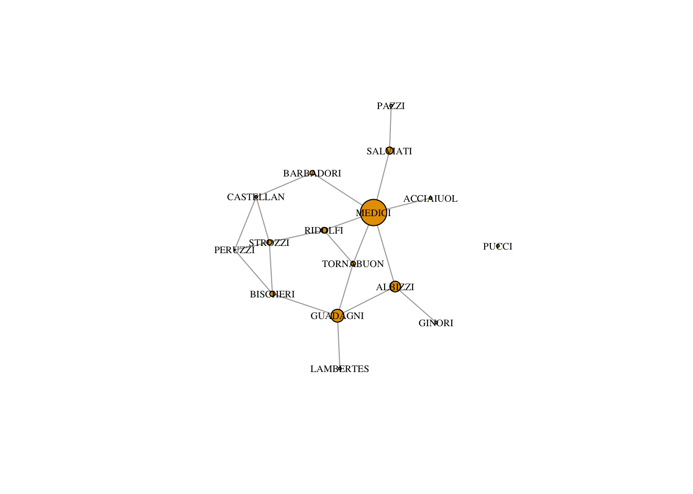

# Centrality

In this tutorial, we look at measures of network centrality, which we use to identify structurally important actors. We also discuss possible ideas for identifying important edges. 

Centrality originally referred to how central actors are in a network's structure. It has become abstracted as a term from its topological origins and now refers very generally to how important actors are to a network. Topological centrality has a clear definition, but many operationalizations. Network "importance" on the other hand has many definitions _and_ many operationalizations. We will explore the possible meanings and operationalizations of centrality here. There are four well-known centrality measures: degree, betweenness, closeness and eigenvector - each with its own strengths and weaknesses. The main point we want to make is that the analytical usefulness of each depends heavily on the context of the network, the type of relation being analyzed and the underlying network morphology. We don't want to leave you with the impression that one is better than another - only that one might serve your research goals better than another.

Every node-level measure has its graph-level analogue. Centralization measures the extent to which the ties of a given network are concentrated on a single actor or group of actors. We can also look at the degree distribution.  It is a simple histogram of degree, which tells you whether the network is highly unequal or not.

### Loading the example network

As always, we need to load igraph. We will load in tidyverse too in case we need to do some data munging or plotting.


```r
library(igraph)
```

```
## 
## Attaching package: 'igraph'
```

```
## The following objects are masked from 'package:stats':
## 
##     decompose, spectrum
```

```
## The following object is masked from 'package:base':
## 
##     union
```

```r
library(tidyverse)
```

```
## ── Attaching packages ─────────────────────────────────────────── tidyverse 1.3.0 ──
```

```
## ✓ ggplot2 3.2.1     ✓ purrr   0.3.3
## ✓ tibble  2.1.3     ✓ dplyr   0.8.3
## ✓ tidyr   1.0.0     ✓ stringr 1.4.0
## ✓ readr   1.3.1     ✓ forcats 0.4.0
```

```
## ── Conflicts ────────────────────────────────────────────── tidyverse_conflicts() ──
## x dplyr::as_data_frame() masks tibble::as_data_frame(), igraph::as_data_frame()
## x purrr::compose()       masks igraph::compose()
## x tidyr::crossing()      masks igraph::crossing()
## x dplyr::filter()        masks stats::filter()
## x dplyr::groups()        masks igraph::groups()
## x dplyr::lag()           masks stats::lag()
## x purrr::simplify()      masks igraph::simplify()
```

```r
library(reshape2)
```

```
## 
## Attaching package: 'reshape2'
```

```
## The following object is masked from 'package:tidyr':
## 
##     smiths
```

We will use John Padgett's Florentine Families dataset. It is a subset of a famous historical datset about the relationships of prominent Florentine families in 15th century Italy. The historical puzzle is how the Medici, an upstart family, managed to accumulate political power during this period. Padgett's goal was to explain their rise. 

He looked at many relations, and Moreno's website provides access to both marriage and business ties, but we will focus on marriage here. Marriage was a tool in diplomacy, central to political alliances. A tie is drawn between families if the daughter of one family was sent to marry the son of another. 

Ron Breiger, who analyzed these data in a famous paper on local role analysis, has argued these edges should be directed, tracing where daughters were sent or where finances flowed, but we only have access to the symmetrized (undirected) versions.

As always, we first load and prepare the dataset. We will do so directly from Moreno's site, cleaning the data along the way. 

```r
# a function to clean data from UCI net which is not space or tab separated
clean_uci_lines <- function(x){
  x <- strsplit(x, " ")
  x <- lapply(x, function(x) subset(x, x != ""))
  x <- do.call("rbind", x)
  x <- as.data.frame(x)
  return(x)
}

# prepare the marriage adjacency matrix
florentine_adj <- readLines("http://moreno.ss.uci.edu/padgett.dat")
family_names <- florentine_adj[5:20]

marriage <- florentine_adj[42:57]
marriage <- clean_uci_lines(marriage)
rownames(marriage) <- colnames(marriage) <- as.character(family_names)

# business <- florentine_adj[58:73]
# business <- clean_uci_lines(business)
# rownames(business) <- colnames(business) <- as.character(business)

# prepare the attributes file
florentine_attributes <- readLines("http://moreno.ss.uci.edu/padgw.dat")
family_names = florentine_attributes[5:20]
atts <- florentine_attributes[26:41]
atts <- clean_uci_lines(atts)
atts <- cbind(family_names, atts)
colnames(atts) <- c("FamilyNames", "Wealth", "#Prior", "#Ties")

# graph the marriage network
marriageNet <- graph.adjacency(as.matrix(marriage), mode = "undirected")
marriageNet = simplify(marriageNet)
V(marriageNet)$Wealth <- atts$Wealth[match(V(marriageNet)$name, atts$FamilyNames)]
V(marriageNet)$Priorates <- atts[match(V(marriageNet)$name, atts$FamilyNames), "#Prior"]
```

Let's see how it looks.


```r
plot(marriageNet, vertex.size = 8, vertex.label.cex = .4, vertex.label.color = "black", vertex.color = "tomato")
```


Based on this plot, which family do you expect is most central?

### Degree Centrality

The simplest measure of centrality is degree centrality. It counts how many edges each node has - the most degree central actor is the one with the most ties. 

> **Note:** In a directed network, you will need to specify if in or out ties should be counted. These will be referred to as in or out degree respectively. If both are counted, then it is just called degree

Degree centrality is calculated using the degree function in R. It returns how many edges each node has.


```r
degree(marriageNet) 
```

```
## ACCIAIUOL   ALBIZZI BARBADORI  BISCHERI CASTELLAN    GINORI  GUADAGNI LAMBERTES 
##         1         3         2         3         3         1         4         1 
##    MEDICI     PAZZI   PERUZZI     PUCCI   RIDOLFI  SALVIATI   STROZZI TORNABUON 
##         6         1         3         0         3         2         4         3
```

Who is the most degree central? 

We can assign the output to a variable in the network and size the nodes according to degree.


```r
V(marriageNet)$degree <- degree(marriageNet) # assignment

plot(marriageNet, vertex.label.cex = .6, vertex.label.color = "black", vertex.size = V(marriageNet)$degree, vertex.label.cex = .2) # sized by degree
```


The problem is that the degree values are a little small to plot well. We can use a scalar to increase the value of the degree but maintain the ratio.


```r
plot(marriageNet, 
     vertex.label.cex = .6, 
     vertex.label.color = "black", 
     vertex.size = V(marriageNet)$degree*3)
```


### Betweenness Centrality

Betweenness centrality captures which nodes are important in the flow of the network. It makes use of the shortest paths in the network. A path is a series of adjacent nodes. For any two nodes we can find the shortest path between them, that is, the path with the least amount of total steps (or edges). If a node C is on a shortest path between A and B, then it means C is important to the efficient flow of goods between A and B.  Without C, flows would have to take a longer route to get from A to B. 

Thus, betweenness effectively counts how many shortest paths each node is on. The higher a node's betweenness, the more important they are for the efficient flow of goods in a network.

In igraph, betweenness() computes betweenness in the network


```r
betweenness(marriageNet, directed = FALSE)
```

```
## ACCIAIUOL   ALBIZZI BARBADORI  BISCHERI CASTELLAN    GINORI  GUADAGNI LAMBERTES 
##  0.000000 19.333333  8.500000  9.500000  5.000000  0.000000 23.166667  0.000000 
##    MEDICI     PAZZI   PERUZZI     PUCCI   RIDOLFI  SALVIATI   STROZZI TORNABUON 
## 47.500000  0.000000  2.000000  0.000000 10.333333 13.000000  9.333333  8.333333
```

We can again assign the output of betweenness() to a variable in the network and size the nodes according to it.


```r
V(marriageNet)$betweenness <- betweenness(marriageNet, directed = F) # assignment

plot(marriageNet, 
     vertex.label.cex = .6, 
     vertex.label.color = "black", 
     vertex.size = V(marriageNet)$betweenness) # sized by betweenness
```


Betweenness centrality can be very large. It is often helpful to normalize it by dividing by the maximum and multiplying by some scalar when plotting. 


```r
plot(marriageNet,
     vertex.label.cex = .6, 
     vertex.label.color = "black", 
     vertex.size = V(marriageNet)$betweenness/max(V(marriageNet)$betweenness) * 20)
```



### Closeness Centrality

With closeness centrality we again make use of the shortest paths between nodes. We measure the distance between two nodes as the length of the shortest path between them. Farness, for a given node, is the average distance from that node to all other nodes.
Closeness is then the reciprocal of farness (1/farness).


```r
closeness(marriageNet)
```

```
## Warning in closeness(marriageNet): At centrality.c:2784 :closeness centrality is
## not well-defined for disconnected graphs
```

```
##   ACCIAIUOL     ALBIZZI   BARBADORI    BISCHERI   CASTELLAN      GINORI 
## 0.018518519 0.022222222 0.020833333 0.019607843 0.019230769 0.017241379 
##    GUADAGNI   LAMBERTES      MEDICI       PAZZI     PERUZZI       PUCCI 
## 0.021739130 0.016949153 0.024390244 0.015384615 0.018518519 0.004166667 
##     RIDOLFI    SALVIATI     STROZZI   TORNABUON 
## 0.022727273 0.019230769 0.020833333 0.022222222
```

We assign it to a node variable and plot the network, adjusting node size by closeness.


```r
V(marriageNet)$closeness <- closeness(marriageNet)
```

```
## Warning in closeness(marriageNet): At centrality.c:2784 :closeness centrality is
## not well-defined for disconnected graphs
```


```r
plot(marriageNet,
     vertex.label.cex = .6, 
     vertex.label.color = "black", 
     vertex.size = V(marriageNet)$closeness/max(V(marriageNet)$closeness) * 20)
```


## Eigenvector Centrality

Degree centrality only takes into account the number of edges for each node, but it leaves out information about ego's alters.

However, we might think that power comes from being tied to powerful people. If A and B have the same degree centrality, but A is tied to all high degree people and B is tied to all low degree people, then intuitively we want to see A with a higher score than B. 

Eigenvector centrality takes into account alters' power. It is calculated a little bit differently in igraph. It produces a list object and we need to extract only the vector of centrality values.


```r
evcent(marriageNet)$vector
```

```
## ACCIAIUOL   ALBIZZI BARBADORI  BISCHERI CASTELLAN    GINORI  GUADAGNI LAMBERTES 
## 0.3071155 0.5669336 0.4919853 0.6572037 0.6019551 0.1741141 0.6718805 0.2063449 
##    MEDICI     PAZZI   PERUZZI     PUCCI   RIDOLFI  SALVIATI   STROZZI TORNABUON 
## 1.0000000 0.1041427 0.6407743 0.0000000 0.7937398 0.3390994 0.8272688 0.7572302
```

Then we can assign that vector to our network and plot it.


```r
V(marriageNet)$eigenvector <- evcent(marriageNet)$vector

plot(marriageNet,
     vertex.label.cex = .6, 
     vertex.label.color = "black", 
     vertex.size = V(marriageNet)$eigenvector/max(V(marriageNet)$eigenvector) * 20)
```


## Bonacich Centrality

```r
V(marriageNet)$bonacich <- power_centrality(marriageNet, exponent = -0.5, rescale = T)
V(marriageNet)$bonacich <- ifelse(V(marriageNet)$bonacich < 0, 0, V(marriageNet)$bonacich)

plot(marriageNet,
     vertex.label.cex = .6, 
     vertex.label.color = "black", 
     vertex.size = V(marriageNet)$bonacich/max(V(marriageNet)$bonacich) * 20)
```


### Measure Correlations

Most of these measures are highly correlated, meaning they don't necessarily capture unique aspects of pwoer. However, the amount of correlation depends on the network structure. Let's see how the correlations between centrality measures looks in the Florentine Family network. cor.test(x,y) performs a simple correlation test between two vectors.


```r
# extract all the vertex attributes
all_atts <- lapply(list.vertex.attributes(marriageNet),function(x) get.vertex.attribute(marriageNet,x))
# bind them into a matrix
all_atts <- do.call("cbind", all_atts)
# add column nams
colnames(all_atts) <- list.vertex.attributes(marriageNet)
# drop the family variable
all_atts <- data.frame(all_atts[,2:ncol(all_atts)])
# convert all to numeric
all_atts <- sapply(all_atts, as.numeric)
# produce a correlation matrix
cormat <- cor(all_atts)
# melt it using reshape to function melt() to prepare it for ggplot which requires long form data
melted_cormat <- melt(cormat)
ggplot(data = melted_cormat, aes(x=Var1, y=Var2, fill=value)) + 
  geom_tile() +
  scale_fill_distiller(palette = "Spectral", direction=-2) +
  xlab("") +
  ylab("")
```


What do we learn?

### Centralization and Degree Distributions

To understand the measures further, we can look at their distributions. This will tell us roughly how many nodes have centralities of a given value.

```r
# fitting a degree distribution on the log-log scale
alter_hist = table(degree(marriageNet))
vals = as.numeric(names(alter_hist))
vals = vals[2:length(vals)]
alter_hist = alter_hist[2:length(alter_hist)]
df = data.frame(Vals = log(vals), Hist = log(as.numeric(alter_hist)), stringsAsFactors = F)

# plot log-log degree distribution
plot(Hist ~ Vals, data = df)

# regression line
abline(lm(Hist ~ Vals, data = df))
```


Do their marriage partners have more marriage partners than they do?

```r
# degrees of your friends
neighbor_degrees <- knn(marriageNet)$knn
degrees <- degree(marriageNet)

mean(neighbor_degrees, na.rm = T)
```

```
## [1] 3.544444
```

```r
mean(degrees)
```

```
## [1] 2.5
```

```r
# plot neighbor degrees vs. ego degress
hist(neighbor_degrees)
```


```r
hist(degrees)
```


We can see that most nodes in the marriage network have low betweenness centrality, and only one node has more than 40 betweenness. Degree distributions tend to be right-skewed; that is, only a few nodes in most networks have most of the ties. Evenly distributed degree is much rarer.

Finally centralization measures the extent to which a network is centered around a single node. The closer a network gets to looking like a star, the higher the centralization score will be. 


```r
degcent <- centralization.degree(marriageNet)$centralization
centralization.betweenness(marriageNet)$centralization
```

```
## [1] 0.3834921
```

```r
centralization.evcent(marriageNet)$centralization
```

```
## [1] 0.5614437
```

```r
centralization.closeness(marriageNet)$centralization
```

```
## Warning in centralization.closeness(marriageNet): At centrality.c:
## 2784 :closeness centrality is not well-defined for disconnected graphs
```

```
## [1] 0.1790292
```

Can we compare our centralization scores against some baseline? Here is an example with Barabasi-Albert model, which simulates a network in which there is preferential attachment with respect to degree, the amount of which is controlled by the power parameter.

```r
N <- vcount(marriageNet)
degcent <- centralization.degree(marriageNet)$centralization

centralizations = c()
powers <- seq(from = 0, to = 3, by = 0.1)
for(e in powers){
  net <- barabasi.game(N, directed = F, power=e)
  centralizations <- c(centralizations, centralization.degree(net)$centralization)
}

power_df <- data.frame(Centralization = centralizations, Power = powers)

ggplot(power_df, aes(x = Power, y = Centralization)) + 
  geom_point() + 
  geom_hline(yintercept = degcent, linetype="dashed", color = "red") +
  theme_bw()
```


## Reach N
What proportion of nodes can any node reach at N steps?  

```r
reach_n =function(x, n = 2){
  r=vector(length=vcount(x))
  for (i in 1:vcount(x)){
    neighb =neighborhood(x, n, nodes=i)
    ni=unlist(neighb)
    l=length(ni)
    r[i]=(l)/vcount(x)
  }
  return(r)
}

two_reach = reach_n(marriageNet, 2)

plot(marriageNet, vertex.size = two_reach * 10, vertex.label.cex = .4, vertex.label.color = "black", vertex.color = "tomato")
```


```r
three_reach = reach_n(marriageNet, 3)

plot(marriageNet, vertex.size = three_reach * 10, vertex.label.cex = .4, vertex.label.color = "black", vertex.color = "tomato")
```


```r
four_reach = reach_n(marriageNet, 4)

plot(marriageNet, vertex.size = four_reach * 10, vertex.label.cex = .4, vertex.label.color = "black", vertex.color = "tomato")
```


```r
five_reach = reach_n(marriageNet, 5)

plot(marriageNet, vertex.size = five_reach * 10, vertex.label.cex = .4, vertex.label.color = "black", vertex.color = "tomato")
```


## Distance weighted reach

```r
distance_weighted_reach=function(x){
  distances=shortest.paths(x) #create matrix of geodesic distances
  diag(distances)=1 # replace the diagonal with 1s
  weights=1/distances # take the reciprocal of distances
  return(apply(weights,1,sum)) # sum for each node (row)
}

dw_reach = distance_weighted_reach(marriageNet) 
dw_reach = dw_reach/max(dw_reach)

plot(marriageNet, vertex.size = dw_reach * 10, vertex.label.cex = .4, vertex.label.color = "black", vertex.color = "tomato")
```


