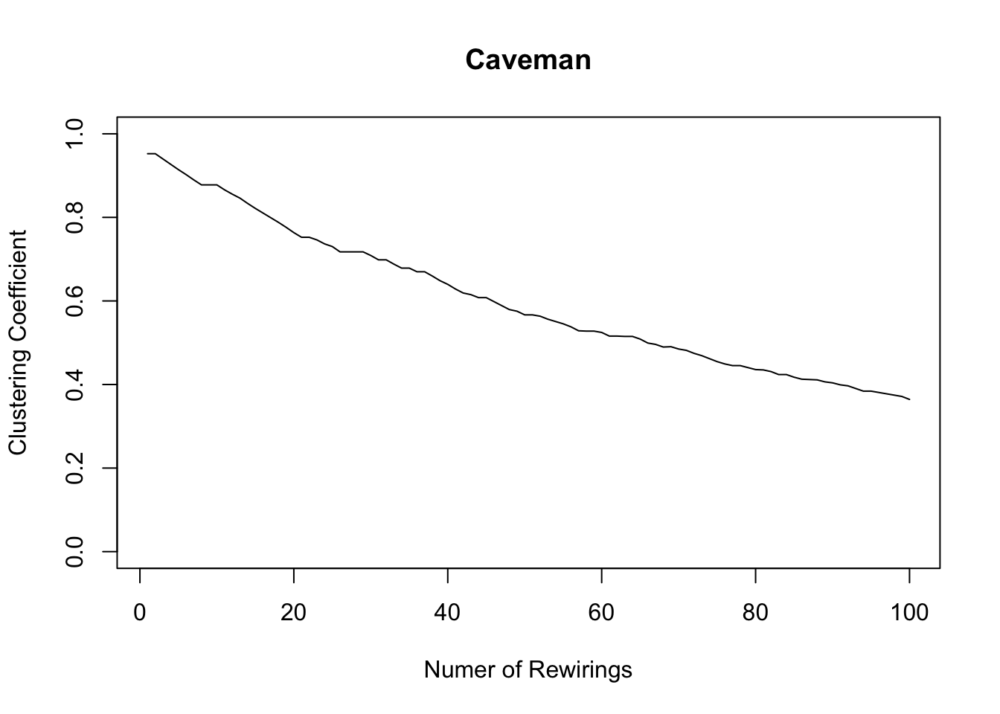

# Bridges, Holes, the Small World Problem, and Simulation

Following our discussion, this week's lab will focus on connectivity, bridging ties, wormholes, structural holes, and the small world problem. First, we will replicate Watts and Strogatz's small world simulation. We will then analyze simulated small world graphs using igraph's functions for measuring connectivity and constraint, and identifying bridging ties and articulation points (nodes whose removal would reduce the connectivity of a graph). We will conclude by looking at a couple of other simulations available in igraph. 

## It's a small world after all. 
Real-world social networks tend to be small worlds.  In a small world, people are clustered in groups, but despite this, are still, on average, socially proximate. For example, you might think that you are socially (and spatially) distant from a random villager in India, but find that through a series of steps, you could reach that villager. The villager lives in her own small world and you live in yours, and yet you are mutually reachable. This is referred to as "the Small-World Phenomenon".

Duncan Watts in his landmark paper explains this phenomenon. He begins with most clustered (and yet connected graph) imaginable - a "caveman" structure. There are groups of people clustered together and connected by only one or two connections to other groups.  

Sadly, igraph doesn't have a function for simulating caveman structures, so we will make use of one I wrote. In this caveman structure, all of the groups will be the same size, so the number of people must be evenly divisible by the size of groups. The basic idea is to generate a bunch of fully connected groups and then connect them by an edge or two so that they are arrayed around a circle.  


```r
simulate_caveman <- function(n = 25, clique_size = 5){
  require(igraph)
  # Groups are all the same size, so I check whether N is divisible by the size of groups
  if ( ((n%/%clique_size) * clique_size) != n){
    stop("n is not evenly divisible by clique_size")
  }
  
  groups = n/clique_size # this determines the number of groups
  
  el <- data.frame(PersonA = 1:n, Group = NA) # I create a dataframe which has people and the groups they are in
  # I treat it like a person to group edgelist
  
  group_vector = c()
  for (i in 1:groups){
    group_vector <- c(group_vector, rep(i, clique_size))
  }  

  el$Group <- group_vector
  
  inc <- table(el) # I use the table function to turn the person to group edgelist into an incidence matrix
  adj <- inc %*% t(inc) # And I use matrix multiplication with the transpose to turn the person to group incidence matrix
  # into a person to person adjacency matrix
  
  diag(adj) <- 0 
  
  g <- graph.adjacency(adj, mode = "undirected") # I graph this matrix

  group_connect <- seq(from = 1, to = n, by = clique_size) # I determine the points of connection using a sequence funciton
  
  for( i in 1:(length(group_connect)-1)){
    p1 <- group_connect[i] + 1
    p2 <- group_connect[i+1]
    g <- add.edges(g, c(p1,p2)) # And I connect the points of connection using add.edges
  }
    g <- add.edges(g, c(group_connect[1],(group_connect[groups]+1))) # finally I connect the ends of the structure so that it forms a circle

    return(g)    
}
```

You don't have to understand every part of this function in order to use it. All you need to do is run the function above so that it is in your R environment. You can then use it.

It has two arguments - number of nodes and the size of the groups. You could change clique_size to 4 or 10.


```r
caveman_net <- simulate_caveman(n = 100, clique_size = 5) 
```

```
## Loading required package: igraph
```

```
## 
## Attaching package: 'igraph'
```

```
## The following objects are masked from 'package:stats':
## 
##     decompose, spectrum
```

```
## The following object is masked from 'package:base':
## 
##     union
```

```r
par(mar = c(2,2,2,2))
plot(caveman_net, layout = layout.kamada.kawai(caveman_net), vertex.size = 2, vertex.label = NA, vertex.color = "grey80")
```


Now you can clearly see what a caveman structure is. Let's analyze it.


```r
graph.density(caveman_net)
```

```
## [1] 0.04444444
```

```r
transitivity(caveman_net) # transitivity() measures clustering coefficient, which essentially says, how clustered is the network overall
```

```
## [1] 0.7894737
```

```r
average.path.length(caveman_net)
```

```
## [1] 10.70101
```

It has a pretty low density since most nodes only have connections within their clique or else one tie outwards. And as I mentioned above, caveman structures are extremely clustered, since most edges are within group.

Path length is also high - basically it takes 10 steps, on average, to reach one node from a random other node. In the real world, there are way more than 100 people and more than 20 groups, so it should be even more surprising that the average degree of separation is roughly six or seven steps. It follows that the "caveman structure" is not a small-world.

We can look at the diameter of the network to see this too. The diameter is the longest shortest path.


```r
nodes_diameter<-get.diameter(caveman_net)
edges_incident <- get.edge.ids(caveman_net, nodes_diameter)

V(caveman_net)$color<-"grey60" # Set default color for nodes
V(caveman_net)[nodes_diameter]$color<-"green" # Set the nodes on the diameter to be green

E(caveman_net)$color<-"grey70" # Set default edge color
E(caveman_net)[edges_incident]$color<-"green" # Set the edges on the diameter to be green

plot(caveman_net, layout = layout.kamada.kawai(caveman_net), vertex.size = 2, vertex.label = NA)
```


Watts wants to get from this network structure, to one in which the average path length is much lower. He performs a simple exercise to do so (and one we have already experimented with). He randomly rewires the network so that it begins, slowly to approximate a random graph. Random graphs have low average path length; so this is a good idea.

We end up with a caveman structure with some number of rewired edges that will have the tendency to cut across the network


```r
caveman_net_rewired <-  rewire(caveman_net, keeping_degseq(niter = 1000))
```

We can use the rewire function to rewire the network. keeping_degseq() ensures that the degree distribution does not change and niter = 20 is the number of iterations (rewirings).


```r
E(caveman_net_rewired)$color <- "grey80"
V(caveman_net)$color <- "grey60"

plot(caveman_net_rewired, layout = layout.kamada.kawai(caveman_net), vertex.size = 2, vertex.label=NA)
```


Most of the rewirings cut across the network structure!


```r
plot(caveman_net_rewired, layout = layout.kamada.kawai(caveman_net_rewired), vertex.size = 2, vertex.label = NA)
```


Let's compare this to the caveman network.


```r
graph.density(caveman_net_rewired) 
```

```
## [1] 0.04444444
```

```r
transitivity(caveman_net_rewired) 
```

```
## [1] 0.02368421
```

```r
average.path.length(caveman_net_rewired)
```

```
## [1] 3.322626
```
Density is unchanged. Clustering coefficient is less than before, but still relatively high. And average.path.length was cut in half. Only 20 rewirings and look at the change!

We can analyze the change as we perform more rewirings. 


```r
caveman_net_rewired <- simulate_caveman(n = 100, clique_size = 10)
avgpathlength <- average.path.length(caveman_net_rewired) # These are the first observation
clusteringcoefficient <- transitivity(caveman_net_rewired)

iter = 100
for ( i in 2:iter){
  caveman_net_rewired <- caveman_net_rewired %>% rewire(keeping_degseq(niter = 1))
  avgpathlength <- c(avgpathlength, average.path.length(caveman_net_rewired)) # We are just appending the result to a vector
  clusteringcoefficient <- c(clusteringcoefficient, transitivity(caveman_net_rewired))
}

plot(1:100, avgpathlength, xlab = "Numer of Rewirings", ylab = "Average Path Length", main = "Caveman", type = "l")
lines(1:100, clusteringcoefficient)
```


```r
plot(1:100, clusteringcoefficient, xlab = "Numer of Rewirings", ylab = "Clustering Coefficient", main = "Caveman", type = "l", ylim = c(0,1))
```




## Measuring connectivity of networks

Let's say that one of the small-world graphs resulting from this simulation were a real network that we had collected with an online survey. 

```r
caveman_net_rewired <-  rewire(caveman_net, keeping_degseq(niter = 10))
```

How might we go about analyzing it, identifying things like bridges and cut-points, and evaluating the degree of its connectivity? So far we have learned a few useful measures - like the diameter, the average shortest path length, and the clustering coefficient. But there are many others too. In what follows, we'll explore some of the options that igraph provides. 

First, imagine that we wanted to highlight every bridge in the network, not just the diameter. Unfortunately, igraph doesn't have a function for identifying bridges, so we will have to build one ourselves. 

The basic idea is that a bridge is the only tie that connects two otherwise distinct components in a network. We can use the decompose.graph, to decompose it into its constituitive components. Then we loop through the edges in the network, deleting them one at a time, and evaluating if the number of components changes as a result of the deletion. If there is a change, then we save the edge id as a bridge, otherwise we just continue on. Finally, we return all of the bridge ids. 

```r
bridges <- function(net){
  bridges <- c() # empty vector to store bridge names in 
  number_components <- length(decompose.graph(net)) # grab the number of components in the original raph
  for (i in 1:length(E(net))) { # begin a loop through all of the edges
    net_sub <- delete.edges(net, i) # delete the edge in question
    if(length(decompose.graph(net_sub) ) > number_components){ # if the number of components has increased
      bridges <- c(i, bridges)  # save this edge as a bridge
    } 
  }
  return(bridges) # return the set of bridges
}
```
Let's try it on the caveman network. 

```r
bridges(caveman_net_rewired)
```

```
## NULL
```

Hmm, there are no bridges in our graph. I guess that makes sense - since there is a lot of redundancy in the small world graphs we saw previously So perhaps we need a different measure, which following Park et al., measures a tie's range, rather than just whether it is a bridge or not. igraph doesn't have that either, but we can make it ourselves. The basic idea is to again loop through the edges in a network, evaluate which vertices are incident to those edges, delete the edge in question, and evaluate how the distance between the vertices changed as a result. 


```r
tie_range <- function(net){
  tie_ranges <- c() # empty vector to save ranges
  for (i in 1:length(E(net))) { # loop through edges
    incident_vertices <- ends(net, i) # which nodes are incident to the edge in quetion
    net_sub <- delete.edges(net, i) # delete the edge
    updated_distance <- distances(net_sub, v = incident_vertices[1,1], to = incident_vertices[1,2], mode = "all") # evaluate the distance for the previously connected nodes
    tie_ranges <- c(tie_ranges, updated_distance) # save the result
  }
  return(tie_ranges) # return the resulting tie ranges
}

tie_range(caveman_net_rewired)
```

```
##   [1]  2  2  5  2  2  2  2  2  2  2  2  2  2  2  2  2  2  2  2  2  2  2  2  2  2
##  [26]  2  2  2  2  2  2  2  2  2  2  2  2  2  2  2  2  2  2  2  2  2  2  2  2  2
##  [51]  2  5  2  2  2  2  2  2  2  2  2  2  2  2  2  2  2  2  2  2  2  5  2  2  2
##  [76]  2  2  2  2  2  5  2  2  2  2  2  4  2  4  2  2  5  2  2  2  2  2  5  2  2
## [101]  2  2  2  2  2  2  2  2  2  2  2  2  2  2  5  2  2  2  5  2  2  2  3  2  2
## [126]  2  2  2  2  2  2  2  2  2  2  3  3  2  2  2  2  2  3  2  2  3  2  4  2  4
## [151]  5  2  2  2  2  2  2  2  2  2  2  2  2  2  2  2  2  2  2  5  2  5  2  2  2
## [176]  2  2  2  2  2  2  2  2  2  2  2  2  2  2  2  2  2  2  2  2  2  2  2  2  2
## [201] 14 14 14 14 14 11 11  9  4  5  5  3  3  5  3  6  6  9  9  9
```

Most of the edges have ranges of around 2 but a few have a range of 11 or more! Let's plot the graph, adjusting the width of edges according to 

```r
E(caveman_net_rewired)$color <- "grey80"
V(caveman_net)$color <- "grey60"

E(caveman_net_rewired)$range <- tie_range(caveman_net_rewired)

plot(caveman_net_rewired, 
     layout = layout.kamada.kawai(caveman_net_rewired), 
     vertex.size = 2, 
     vertex.label=NA, 
     edge.width = E(caveman_net_rewired)$range/2)
```


Cool!

It feels like we have been doing a lot of the heavy lifting here.. What, in relation to connectivity, does igraph have? Well it has a couple of interesting connectivity measures that we didn't encounter in the literature: edge connectivity and vertex connectivity. As igraph describes, "the vertex connectivity of two vertices in a graph is the minimum number of vertices needed to remove from the graph to eliminate all paths from source to target."  The vertex connectivity of a graph is the minimum vertex connectivity of all pairs of vertices in the graph. It signifies how many vertices would need to delete, on average, to sever the connectivity between any two nodes in the network. This highlights the redundancy of the caveman graph and explains why we didn't find any bridges.


```r
vertex_connectivity(caveman_net_rewired)
```

```
## [1] 2
```

Naturally, edge connectivity of two vertices is the number of edges needed to remove from the graph to eliminate all paths between them.

```r
edge_connectivity(caveman_net_rewired)
```

```
## [1] 2
```

It also has Burt's measure of network constraint!


```r
constraint(caveman_net_rewired)
```

```
##         1         2         3         4         5         6         7         8 
## 0.3382000 0.4512000 0.6135937 0.4659375 0.6135937 0.5093000 0.5093000 0.7015625 
##         9        10        11        12        13        14        15        16 
## 0.7015625 0.7015625 0.5093000 0.5093000 0.7015625 0.7015625 0.7015625 0.5093000 
##        17        18        19        20        21        22        23        24 
## 0.5093000 0.7015625 0.7015625 0.7015625 0.5093000 0.5093000 0.7015625 0.7015625 
##        25        26        27        28        29        30        31        32 
## 0.7015625 0.3382000 0.4512000 0.4659375 0.6135937 0.6135937 0.5093000 0.5093000 
##        33        34        35        36        37        38        39        40 
## 0.7015625 0.7015625 0.7015625 0.3382000 0.4512000 0.4659375 0.6135937 0.6135937 
##        41        42        43        44        45        46        47        48 
## 0.2950000 0.2450000 0.3803125 0.4507813 0.3126562 0.3382000 0.3922000 0.3126562 
##        49        50        51        52        53        54        55        56 
## 0.4478125 0.5245312 0.5093000 0.5093000 0.7015625 0.7015625 0.7015625 0.3922000 
##        57        58        59        60        61        62        63        64 
## 0.3382000 0.3126562 0.5245312 0.4478125 0.3382000 0.4512000 0.6135937 0.4659375 
##        65        66        67        68        69        70        71        72 
## 0.6135937 0.3981000 0.2401000 0.5334375 0.4659375 0.4659375 0.3382000 0.3382000 
##        73        74        75        76        77        78        79        80 
## 0.4478125 0.2500000 0.4478125 0.3500000 0.3500000 0.6215625 0.6215625 0.6215625 
##        81        82        83        84        85        86        87        88 
## 0.4463000 0.4463000 0.6062500 0.4478125 0.4478125 0.3382000 0.4512000 0.4659375 
##        89        90        91        92        93        94        95        96 
## 0.6135937 0.6135937 0.5093000 0.5093000 0.7015625 0.7015625 0.7015625 0.5093000 
##        97        98        99       100 
## 0.5093000 0.7015625 0.7015625 0.7015625
```

How correlated is it with betweenness centrality?

```r
cor.test(constraint(caveman_net_rewired), betweenness(caveman_net_rewired))
```

```
## 
## 	Pearson's product-moment correlation
## 
## data:  constraint(caveman_net_rewired) and betweenness(caveman_net_rewired)
## t = -9.3685, df = 98, p-value = 2.843e-15
## alternative hypothesis: true correlation is not equal to 0
## 95 percent confidence interval:
##  -0.7786507 -0.5675666
## sample estimates:
##        cor 
## -0.6873578
```

Pretty negatively correlated, which makes perfect sense. 

### One last thing... 

After this laborious lab, you might be annoyed to hear that igraph has its own small world simulation. It starts from a lattice structure, though, instead of a caveman. Watts and Strogatz mention in their AJS paper that the same results hold whether a lattice or caveman structure is used as the starting point of the simulation, but the caveman verion is much prettier than the lattice. Still, if you want to simulate quickly many small world graphs of size N and don't want to deal with the limitations of the caveman simulation, this may be a good option.


```r
sample_smallworld(dim, size, nei, p, loops = FALSE, multiple = FALSE)
```

