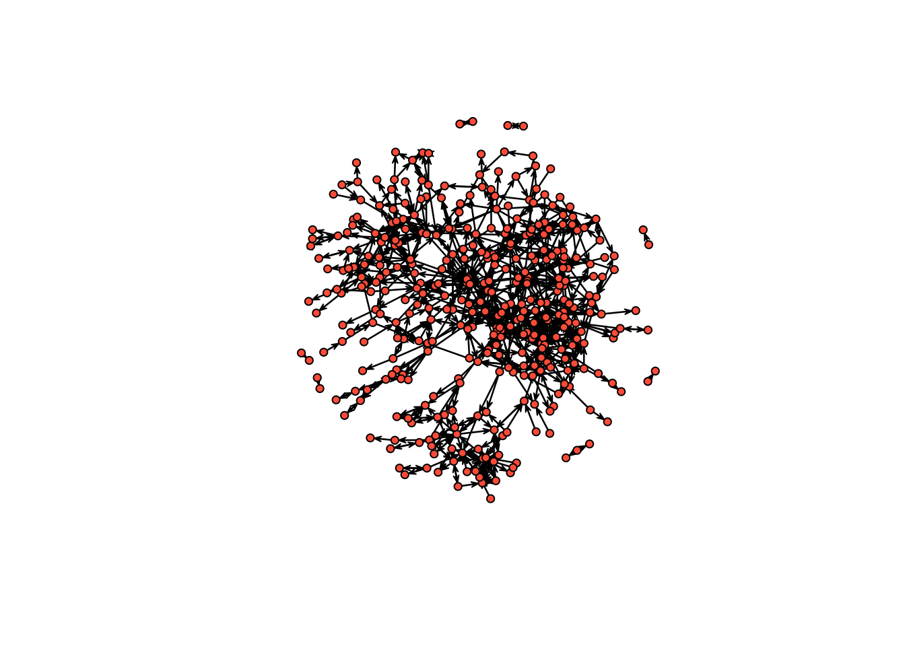
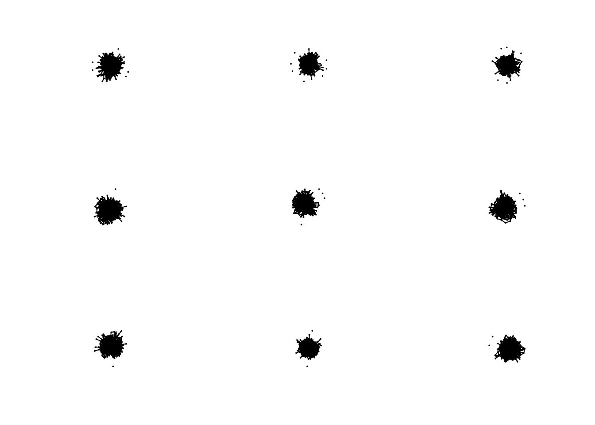
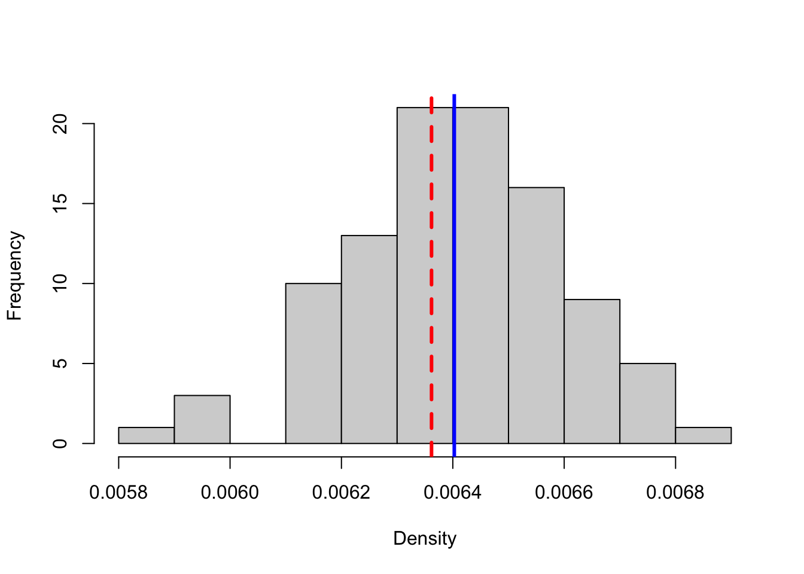
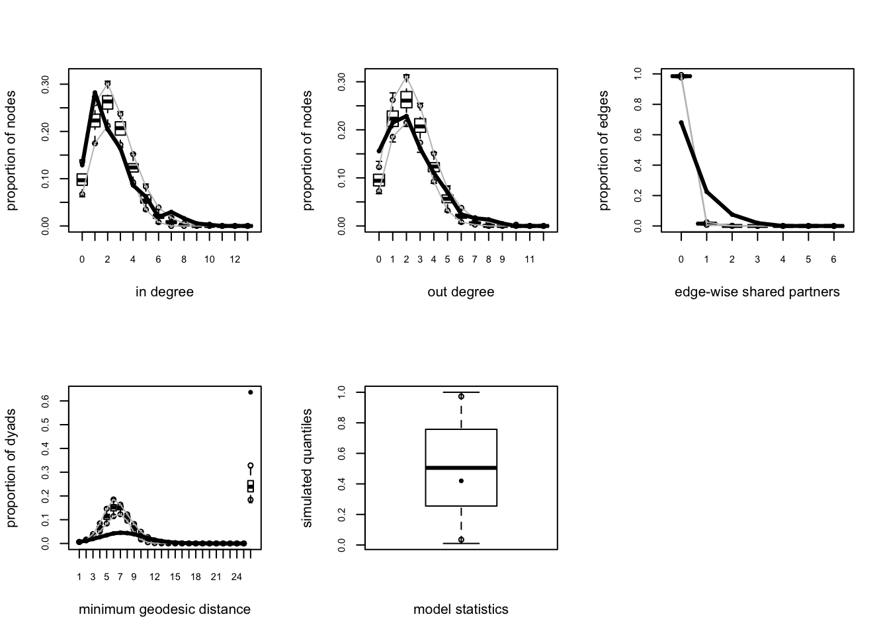
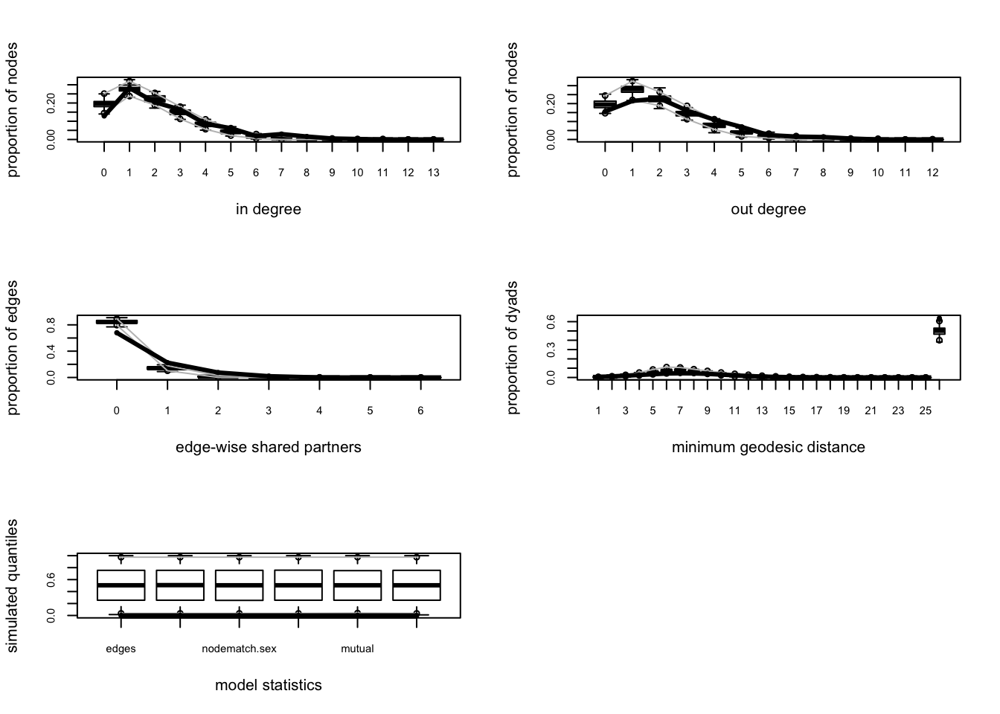

# Homophily and Exponential Random Graphs (ERGM)
## Homophily
In this tutorial, we cover how to A) calculate homophily on a network and B) fit exponential random graphs to networks. First, we will need one of the Add Health data sets that we have been playing around with in previous tutorials. The code below downloads the data from Moreno's website and converts it into an igraph object. We went over this in the Transitivy tutorial, so here, I just paste the code.

```r
# First read in igraph
library(igraph)
```

```
## 
## Attaching package: 'igraph'
```

```
## The following objects are masked from 'package:stats':
## 
##     decompose, spectrum
```

```
## The following object is masked from 'package:base':
## 
##     union
```

```r
# read in the edge list from moreno.ss.uci
el <- readLines("http://moreno.ss.uci.edu/comm37.dat")
# drop the unnecessary filler lines
el <- el[5:length(el)]
# split each line by space
el <- strsplit(el, " ")
# drop empty items in the lines
el <- lapply(el, function(x) subset(x, x != ""))
# bind it all together into a matrix
el <- do.call("rbind", el)

# Read in attributes from moreno.ss.uci
attributes <- readLines("http://moreno.ss.uci.edu/comm37_att.dat")
# drop the unnecessary filler lines
attributes <- attributes[12:length(attributes)]
# split each line by space
attributes <- strsplit(attributes, " ")
# drop empty items in the lines
attributes <- lapply(attributes, function(x) subset(x, x != ""))
# bind it all together into a matrix
attributes <- do.call("rbind", attributes)
# convert to a data.frame
attributes <- as.data.frame(attributes, stringsAsFactors = F)
# add the column names
colnames(attributes) = c("sex", "race", "grade")
# add an ID column
attributes$ID <- 1:nrow(attributes)

# Indexing data so that you only put in certain columns
el_no_weight <- el[,1:2] # We will ignore the ranking variable for now.

# Graph the network
net37 <- graph.edgelist(el_no_weight, directed = T)

# Finally, add attributes  
# First link vertex names to their place in the attribute dataset
linked_ids <- match(V(net37)$name, attributes$ID)

# Then we can use that to assign a variable to each user in the network
V(net37)$race <- attributes$race[linked_ids]
V(net37)$sex <- attributes$sex[linked_ids]
V(net37)$grade <- attributes$grade[linked_ids]

net37 <- delete.vertices(net37, which(is.na(V(net37)$sex) | V(net37)$sex == 0))
net37 <- delete.vertices(net37, which(is.na(V(net37)$race) | V(net37)$race == 0))
net37 <- delete.vertices(net37, which(is.na(V(net37)$grade) | V(net37)$grade == 0))
```

Great, now that we have the network, we can evaluate homophily. We can either use igraph's built in function...

```r
assortativity(net37, types1 = as.numeric(V(net37)$sex))
```

```
## [1] 0.1451624
```

Or do it ourselves. If you'll remember from class on Tuesday, assortativity on variable is calculated by simply correlating the values of an attribute for every ego-alter pair in the network. We just grab the edgelist, match in ego and alter's values for the variable of interest, and correlate with cor.test.

```r
df <- data.frame(get.edgelist(net37), stringsAsFactors = F)
df$sex1 <- as.numeric(attributes$sex[match(df$X1, attributes$ID)])
df$sex2 <- as.numeric(attributes$sex[match(df$X2, attributes$ID)])
cor.test(df$sex1, df$sex2)
```

```
## 
## 	Pearson's product-moment correlation
## 
## data:  df$sex1 and df$sex2
## t = 4.3424, df = 876, p-value = 1.574e-05
## alternative hypothesis: true correlation is not equal to 0
## 95 percent confidence interval:
##  0.07976638 0.20931414
## sample estimates:
##       cor 
## 0.1451624
```

Sex, however, is probably better conceptualized as a categorical variable. Assortativity_nominal can be used to evaluate assortativity for categorical variables. It requires a numeric vector, denoting the different categories, which starts at 1, so we add one to the race variable, which starts at 0. 

```r
assortativity_nominal(net37, types = as.numeric(V(net37)$race) + 1)
```

```
## [1] 0.5438482
```

## ERGMs

Now imagine, like Wimmer and Lewis, we wanted to calculate homophily for race, but wanted to control for other network factors, such as transitivity, which might lead to a higher degree of same race friendships, but which don't actually signal an in-group preference. Just like them, we can use exponential random graphs, which model networks as a function of network statistics. Specifically, ERGMs imagine the observed network to be just one instantiation of a set of possible networks with similar features, that is, as the outcome of a stochastic process, which is unknown and must therefore be inferred. 

The package that allows one to fit ergm models is part of the statnet (statistical networks) suite of packages. Much like tidyverse, which you might be familiar with, statnet includes a number of complementary packages for the statistical analysis of networks. Let's install statnet and load it into R. 


```r
install.packages("statnet")
```


```r
library(statnet)
```

Great, now we can use statnet's ergm() function to fit our first ERGM. The only problem? Our network is an igraph object rather than a statnet one. There is some good news though. People have built a package for converting igraph objects to statnet and vise versa - intergraph. Let's install that and load it in too. 

```r
install.packages("intergraph")
```

```r
library(intergraph)
```

Now that we have intergraph installed and in our R environment, we can use the asNetwork function to convert it to a statnet object. 


```r
statnet37 <- asNetwork(net37)
statnet37
```

```
##  Network attributes:
##   vertices = 372 
##   directed = TRUE 
##   hyper = FALSE 
##   loops = FALSE 
##   multiple = FALSE 
##   bipartite = FALSE 
##   total edges= 878 
##     missing edges= 0 
##     non-missing edges= 878 
## 
##  Vertex attribute names: 
##     grade race sex vertex.names 
## 
## No edge attributes
```

It even ported over our node attributes! You can plot it to see if it looks the same as it did in igraph. 

```r
plot(statnet37, 
     vertex.col = "tomato", 
     vertex.cex = 1)
```


Epico! I love pomodoros. 

With our data ready for analysis using statnet, let's build our first ERGM. There are a number of potential ERG model terms that we could use in fitting our model. You can view a full list by looking at the documentation for: 

```r
?ergm.terms
```

That said, it is common to build up from some basic terms first. The McFarland-Moody paper we read in class is a useful reference point as is the Wimmer-Lewis paper. Generally, the first term that people use is the edges term. It is a statistic which counts how many edges there are in the network.  

```r
random_graph <- ergm(statnet37 ~ edges)
```
How do we interpret this coefficient? Coefficients in ERGMs represent the change in the (log-odds) likelihood of a tie for a unit change in a predictor. We can use a simple formula for converting log-odds to probability to understand them better. 

```r
logit2prob <- function(logit){
  odds <- exp(logit)
  prob <- odds / (1 + odds)
  return(prob)
}

theta <- random_graph$coef
logit2prob(theta)
```

```
##       edges 
## 0.006361766
```

So the probability of an edge being in the graph is roughly 0.02. The probability of an edge being drawn should in theory be the same as density - let's check. 


```r
network.density(statnet37)
```

```
## [1] 0.006361766
```

Nice. 

To put it all back into the theoretical underpinnings of ERGMs, we have modeled a stochastic generating process, and the only constraint we have put on the stochastic process is the probability with which edges are drawn, which was set equal to the network density of our observed graph. 

We can more closely examine the model fit using the summary() function, just like lm() or glm() in base R. 

```r
summary(random_graph)
```

```
## 
## ==========================
## Summary of model fit
## ==========================
## 
## Formula:   statnet37 ~ edges
## 
## Iterations:  7 out of 20 
## 
## Monte Carlo MLE Results:
##       Estimate Std. Error MCMC % z value Pr(>|z|)    
## edges -5.05107    0.03385      0  -149.2   <1e-04 ***
## ---
## Signif. codes:  0 '***' 0.001 '**' 0.01 '*' 0.05 '.' 0.1 ' ' 1
## 
##      Null Deviance: 191325  on 138012  degrees of freedom
##  Residual Deviance:  10631  on 138011  degrees of freedom
##  
## AIC: 10633    BIC: 10643    (Smaller is better.)
```

We can also simulate graphs using our ERGM fit. We did something similar to this when we simulated random graphs and set the probability of an edge being drawn to be equal to our network's density. We just didn't know it at the time!


```r
set.seed(1234)
hundred_simulations <- simulate(random_graph, 
                  coef = theta,
                  nsim = 100,
                  control = control.simulate.ergm(MCMC.burnin = 1000,
                                             MCMC.interval = 1000))
```

Let's examine the first nine simulations.

```r
par(mfrow = c(3, 3))
sapply(hundred_simulations[1:9], plot, vertex.cex = 1, vertex.col = "tomato")
```



Lots of spaghetti. 

We can compare the number of edges our observed graph has to the average of the simulated networks.

```r
net_densities <- unlist(lapply(hundred_simulations, network.density))

hist(net_densities, xlab = "Density", main = "", col = "lightgray")
abline(v = network.density(statnet37), col = "red", lwd = 3, lty = 2)
abline(v = mean(net_densities), col = "blue", lwd = 3, lty = 1)
```



Pretty close!

Another way to evaluate our model is to use the built-in goodness of fit measures. Essentially, we will evaluate whether our network has similar structural features as the simulated graphs. ergm has a built-in function - gof() - which calculates the statistics for us. We just have to tell it how many simulations we want to use in the comparison set - the larger the number, the more accurate representation of the model.


```r
gof_stats <- gof(random_graph,
                    control.gof.formula(nsim = 100),
                    coef = theta)

par(mfrow = c(2, 3))
plot(gof_stats, main = '')
```



On one measure, edgewise shared partners, our model looks okay.  On the others, especially in and out degree, it looks awful. How to we improve our fit? By adding more terms to the model!

First, let's build a model with only dyad-independent terms. Just like with the random graph, we are essentially fitting a logistic regression. 

nodematch is the homophily term in ergm. We can specify the attribute we want to examine as well as the diff argument, which allows for differential levels of homophily for different groups. 


```r
model1 <- ergm(statnet37 ~ edges + 
                 nodematch("race") + 
                 nodematch("sex") + 
                 nodematch("grade"))
```

```
## Warning: `set_attrs()` is deprecated as of rlang 0.3.0
## This warning is displayed once per session.
```


```r
summary(model1)
```

```
## 
## ==========================
## Summary of model fit
## ==========================
## 
## Formula:   statnet37 ~ edges + nodematch("race") + nodematch("sex") + nodematch("grade")
## 
## Iterations:  8 out of 20 
## 
## Monte Carlo MLE Results:
##                 Estimate Std. Error MCMC % z value Pr(>|z|)    
## edges           -7.32727    0.10467      0 -70.005   <1e-04 ***
## nodematch.race   1.36347    0.08282      0  16.462   <1e-04 ***
## nodematch.sex    0.28343    0.06989      0   4.055   <1e-04 ***
## nodematch.grade  2.59066    0.07991      0  32.419   <1e-04 ***
## ---
## Signif. codes:  0 '***' 0.001 '**' 0.01 '*' 0.05 '.' 0.1 ' ' 1
## 
##      Null Deviance: 191325  on 138012  degrees of freedom
##  Residual Deviance:   8987  on 138008  degrees of freedom
##  
## AIC: 8995    BIC: 9034    (Smaller is better.)
```
Every variable is significant! Grade and race have especially large coefficients and all three are positive. 

Let's try it with diff set to T. We will limit our examination to only grade/race/sex categories represented by a large number of vertices in our network. You can examine this using the table function

```r
table(V(net37)$race) # 1 = white, 2 = black, 3 = hispanic, 4 = asian, and 5 = mixed/other
table(V(net37)$sex) # 1 = male, 2 = female
table(V(net37)$grade)

model2 <- ergm(statnet37 ~ edges + 
                 nodematch("race", diff = T, levels = c("1", "2", "5")) + 
                 nodematch("sex", diff = T, levels = c("1", "2")) + 
                 nodematch("grade", diff = T, levels = as.character(c(7:12))))
```


```r
summary(model2)
```

```
## 
## ==========================
## Summary of model fit
## ==========================
## 
## Formula:   statnet37 ~ edges + nodematch("race", diff = T, levels = c("1", 
##     "2", "5")) + nodematch("sex", diff = T, levels = c("1", "2")) + 
##     nodematch("grade", diff = T, levels = as.character(c(7:12)))
## 
## Iterations:  8 out of 20 
## 
## Monte Carlo MLE Results:
##                    Estimate Std. Error MCMC % z value Pr(>|z|)    
## edges              -7.31591    0.10484      0 -69.784  < 1e-04 ***
## nodematch.race.1    1.24352    0.08574      0  14.504  < 1e-04 ***
## nodematch.race.2    2.04938    0.11522      0  17.786  < 1e-04 ***
## nodematch.race.5    1.21022    0.31305      0   3.866 0.000111 ***
## nodematch.sex.1     0.42410    0.10110      0   4.195  < 1e-04 ***
## nodematch.sex.2     0.22460    0.07561      0   2.971 0.002972 ** 
## nodematch.grade.7   4.26440    0.23922      0  17.826  < 1e-04 ***
## nodematch.grade.8   3.22496    0.11645      0  27.693  < 1e-04 ***
## nodematch.grade.9   2.30314    0.10103      0  22.796  < 1e-04 ***
## nodematch.grade.10  2.50185    0.10264      0  24.374  < 1e-04 ***
## nodematch.grade.11  2.37576    0.13321      0  17.835  < 1e-04 ***
## nodematch.grade.12  2.79633    0.14581      0  19.178  < 1e-04 ***
## ---
## Signif. codes:  0 '***' 0.001 '**' 0.01 '*' 0.05 '.' 0.1 ' ' 1
## 
##      Null Deviance: 191325  on 138012  degrees of freedom
##  Residual Deviance:   8844  on 138000  degrees of freedom
##  
## AIC: 8868    BIC: 8986    (Smaller is better.)
```

Interesting! Now let's add some dyad-dependent terms. These can be a bit finnicky, especially transitivity ones.

mutual is the term for reciprocity. 

```r
model3 <- ergm(statnet37 ~ edges + 
                 nodematch("race") + 
                 nodematch("sex") + 
                 nodematch("grade") + 
                 mutual)
```


```r
summary(model3)
```

```
## 
## ==========================
## Summary of model fit
## ==========================
## 
## Formula:   statnet37 ~ edges + nodematch("race") + nodematch("sex") + nodematch("grade") + 
##     mutual
## 
## Iterations:  2 out of 20 
## 
## Monte Carlo MLE Results:
##                 Estimate Std. Error MCMC % z value Pr(>|z|)    
## edges           -7.14144    0.09579      0 -74.554  < 1e-04 ***
## nodematch.race   1.01273    0.08025      0  12.620  < 1e-04 ***
## nodematch.sex    0.20717    0.06478      0   3.198  0.00138 ** 
## nodematch.grade  2.05109    0.08008      0  25.614  < 1e-04 ***
## mutual           4.17605    0.13853      1  30.145  < 1e-04 ***
## ---
## Signif. codes:  0 '***' 0.001 '**' 0.01 '*' 0.05 '.' 0.1 ' ' 1
## 
##      Null Deviance: 191325  on 138012  degrees of freedom
##  Residual Deviance:   8189  on 138007  degrees of freedom
##  
## AIC: 8199    BIC: 8249    (Smaller is better.)
```
Now let's add a term for triadic closure. There are a few terms for triads - one of them, triangles, tends to lead to degeneracy. The gwesp term behaves better, though convergence is far from guaranteed. 

It may be a good time to use the bathroom. This will take a while...


```r
model4 <- ergm(statnet37 ~ edges + 
                 nodematch("race") + 
                 nodematch("sex") + 
                 nodematch("grade") + 
                 mutual + 
                 gwesp(0.25, fixed = T),
               control=control.ergm(MCMLE.maxit= 40))
# you can change a number of other things about the MCMC algorithm - from its burn-in to its step and sample size
# here we just up the maximum iterations we wait to see if it has converged
```

```r
summary(model4)
```

```
## 
## ==========================
## Summary of model fit
## ==========================
## 
## Formula:   statnet37 ~ edges + nodematch("race") + nodematch("sex") + nodematch("grade") + 
##     mutual + gwesp(0.25, fixed = T)
## 
## Iterations:  40 out of 40 
## 
## Monte Carlo MLE Results:
##                  Estimate Std. Error MCMC % z value Pr(>|z|)    
## edges            -6.92024    0.09773      0 -70.810  < 1e-04 ***
## nodematch.race    0.74309    0.08767      0   8.476  < 1e-04 ***
## nodematch.sex     0.21104    0.07708      0   2.738  0.00619 ** 
## nodematch.grade   1.75872    0.08518      0  20.647  < 1e-04 ***
## mutual            3.59555    0.12705      2  28.301  < 1e-04 ***
## gwesp.fixed.0.25  0.78818    0.04309      1  18.293  < 1e-04 ***
## ---
## Signif. codes:  0 '***' 0.001 '**' 0.01 '*' 0.05 '.' 0.1 ' ' 1
## 
##      Null Deviance: 191325  on 138012  degrees of freedom
##  Residual Deviance:   8139  on 138006  degrees of freedom
##  
## AIC: 8151    BIC: 8210    (Smaller is better.)
```

Let's take a look at the goodness-of-fit statistics for this most elaborate model. 

```r
model4_gof <- gof(model4, control.gof.formula(nsim = 100))

par(mfrow = c(3, 2))
plot(model4_gof, main = '')
```



Definitely an improvement over the random graph!
