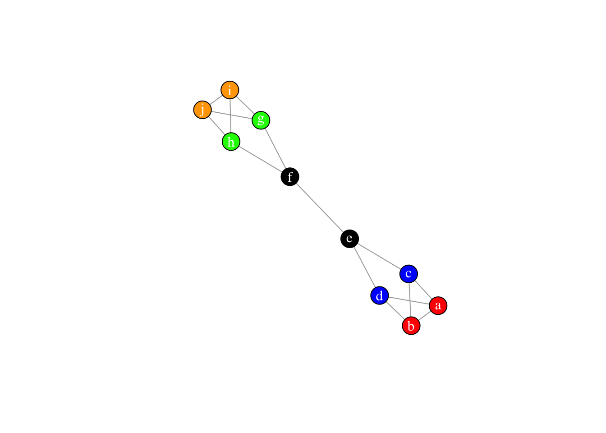
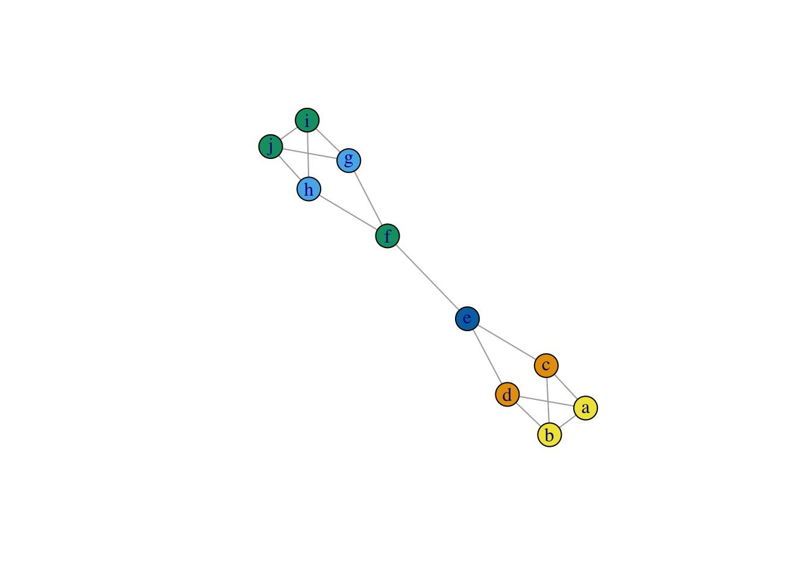
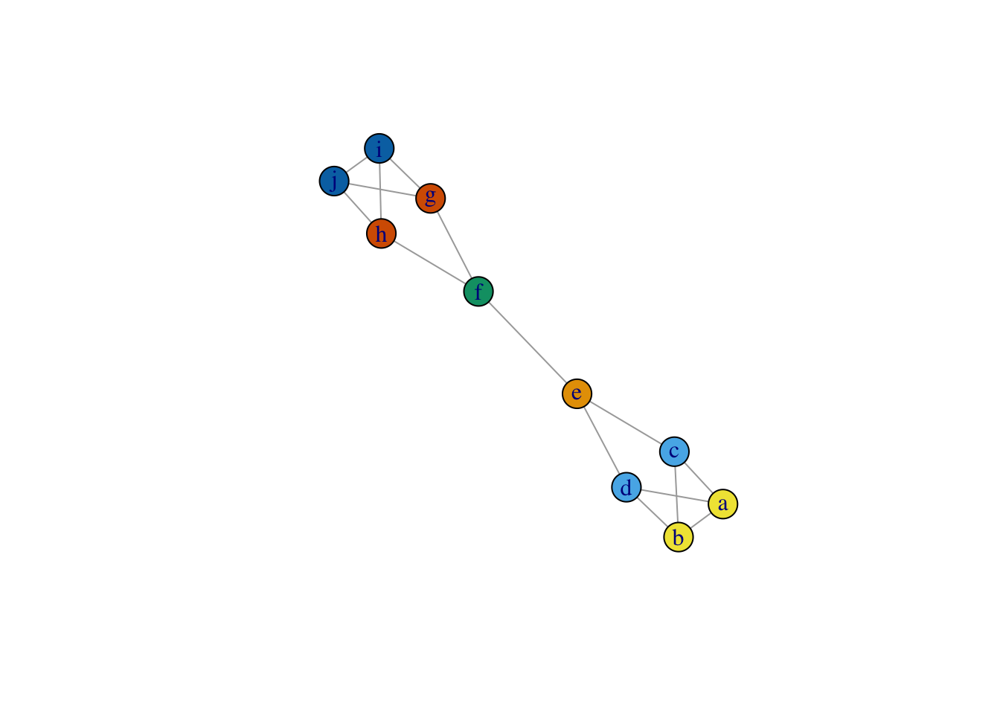
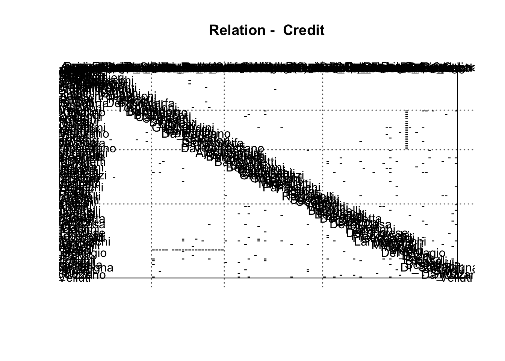
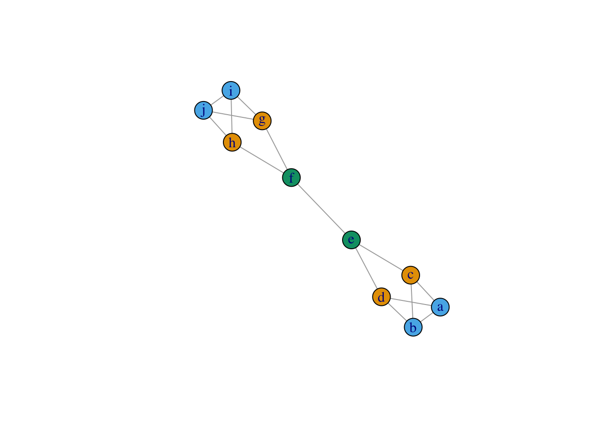
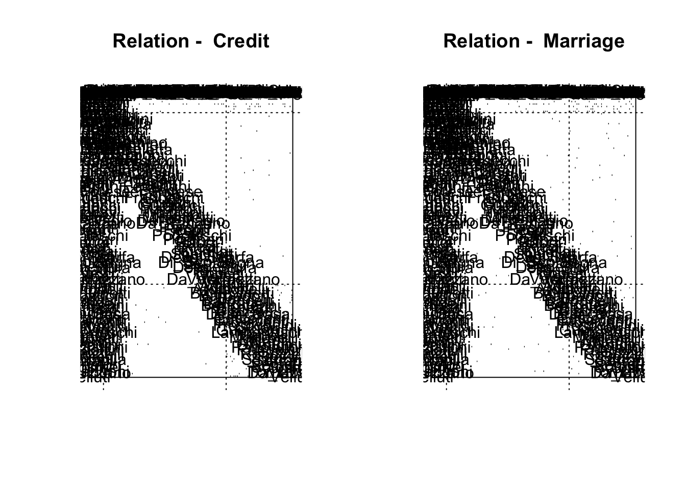

# Positional analysis in networks

This tutorial covers positional analysis in networks. Positional analysis seeks to identify actors or groups of actors who occupy similar positions or roles in a network. Nodes are therefore not grouped because they share more connections with each other than with other nodes in the network, as in modularity-based community or group detection, but rather because they share similar, or even precisely the same, *patterns* of relations. These positions might be though of as roles - in so far as people who occupy similar positions also perform similar functions for the graph - though this need not be the case. 

However, compared to many of the other strategies we have so far seen for grouping and comparing nodes, positional analysis is particularly fraught with difficulty. It relies on one being able to identify which nodes are structurally equivalent, or more specifically, which nodes have identical or similar sets of relations across all other actors in a graph. This would be easy if we just wanted to know if two nodes shared the same exact set of relations - we could just calculate how different their relations are over the other nodes in the network and identify those pairs of nodes who have precisely the relations - but this exact form of equivalence is, in the real world, quite rare. In practice, we are interested in a more generalized notion of structural equivalence, one in which nodes are seen as sharing a position or role not when they have relations with the exact same people, but rather when they share patterns of relations that are generally similar. 

There are a number of strategies for identifying roles or positions in a network. Here, we cover three such strategies: 1) CONCOR, which evaluates approximate structural equivalence to identify positions, 2) stochastic block modeling, which uses a more relaxed notion of stochastic equivalence to identify positions, and 3) feature-based strategies for learning roles in a network. 

Block modeling of this sort is not implemented in igraph, so for much of this tutorial, we will have to rely on our own code. 

## Toy data

Let's make a toy network, where structurally equivalent nodes are easy to identify by eye, against which we can compare the different methods. 


```r
library(igraph)
```

```
## 
## Attaching package: 'igraph'
```

```
## The following objects are masked from 'package:stats':
## 
##     decompose, spectrum
```

```
## The following object is masked from 'package:base':
## 
##     union
```

```r
edge_data <- c("a", "c", 
               "a", "d", 
               "a", "b", 
               "b", "c", 
               "b", "d", 
               "c", "e", 
               "d", "e", 
               "e", "f", 
               "f", "g", 
               "f", "h", 
               "g", "i", 
               "g", "j", 
               "h", "i", 
               "h", "j", 
               "i", "j")

el <- matrix(edge_data, ncol = 2, byrow = T)

net <- graph.edgelist(el, directed = F)
```

What does the network look like? Let's plot it, and color nodes by their equivalence class.


```r
layout_save <- layout_with_fr(net)
plot(net, vertex.color = c("red", "blue", "blue", "red", "black", "black", "green", "green", "orange", "orange"), 
     vertex.label.color = "white", 
     layout = layout_save)
```



## Structural equivalence

Let's begin with an exact measure of structural equivalence - two nodes will be deemed structurally equivalent if they have precisely the same set of relations across all other nodes in the network. To evaluate this, we could simply identify which nodes have exactly the same set of neighbors, or using a matrix, take the absolute difference in row values for two nodes. 

We extract the adjacency matrix.

```r
adj_mat <- as.matrix(as_adj(net))
```

Here is an example for nodes a and b. 

```r
a_row <- adj_mat["a", !colnames(adj_mat) %in% c("a", "b")]
b_row <- adj_mat["b", !colnames(adj_mat) %in% c("a", "b")]

# equivalent?
abs(a_row-b_row)
```

```
## c d e f g h i j 
## 0 0 0 0 0 0 0 0
```

Their absolute difference is equal to 0, so we would say they are equivalent. Let's extrapolate to every pair of nodes in the network with a function.


```r
perfect_equivalence <- function(mat){
  # make an empty version of the matrix where we will store equivalence values
  matrix_vals <- mat
  matrix_vals[] <- 0
  # loop over the actors in the network, comparing pair-wise their values 
  for(i in 1:nrow(mat)){
    for(j in 1:nrow(mat)){
      a_row <- mat[i, c(-i, -j)]
      b_row <- mat[j, c(-i, -j)]
      abs_diff <- sum(abs(a_row-b_row)) # take sum of absolute differences 
      matrix_vals[i,j] <- abs_diff
    }
  }
  # return results
  return(matrix_vals)
}
```
Now we apply the function to our network/matrix. What do you see?

```r
structurally_equivalent <- perfect_equivalence(adj_mat)
structurally_equivalent
```

```
##   a c d b e f g h i j
## a 0 2 2 0 2 6 6 6 6 6
## c 2 0 0 2 4 4 6 6 6 6
## d 2 0 0 2 4 4 6 6 6 6
## b 0 2 2 0 2 6 6 6 6 6
## e 2 4 4 2 0 4 4 4 6 6
## f 6 4 4 6 4 0 4 4 2 2
## g 6 6 6 6 4 4 0 0 2 2
## h 6 6 6 6 4 4 0 0 2 2
## i 6 6 6 6 6 2 2 2 0 0
## j 6 6 6 6 6 2 2 2 0 0
```

Let's convert this distance matrix to a similarity matrix.

```r
structurally_equivalent_sim <- 1-(structurally_equivalent/max(structurally_equivalent))
```

We can now cluster this similarity matrix to identify sets of similar actors using k-means, for example. If we set the number of clusters equal to 6, it will pull out the set of actors who have precisely the same relations. If we set it equal to 5 or 4, it will show us actors who are proximately similar. 


```r
group_ids_6 <- kmeans(structurally_equivalent_sim, centers = 6)
group_ids_5 <- kmeans(structurally_equivalent_sim, centers = 5)
```

How close do we get? 

```r
plot(net, 
     vertex.color = group_ids_5$cluster, 
     layout = layout_save)
```




```r
plot(net, 
     vertex.color = group_ids_6$cluster, 
     layout = layout_save)
```



Close, but there is a problem. This strategy appears to treat e and f as occupying different positions. Why is that? Well, it has to do with our strict definition of structural equivalence - which relies on comparing the precise set of actors that each node is connected to. As a result, our method is confusing similarity with closeness, and as a result, it turns out, nodes that we deem structurally equivalent can never be more than two steps away from one another.

## Block Modeling with CONCOR

Before we deal with our definitional problem, let's work through the CONCOR algorithm, introduced by Breiger et al. and made use of by White, Boorman, and Breiger in their seminal paper, **Social Structure from Multiple Networks. I. Blockmodels of Roles and Positions**. This method relies a similar definition of equivalence as the one outlined above - it identifies structurally equivalent nodes through correlating their relation sets - but because it uses correlation, and implements the stacking of matrices, it allows one to produce a block model of multiple relations simultaneously. 

Let's grab some real data now. I have provided on Canvas data for three relations - marriage, credit provision, and business partnership - from Padgett and Ansell's paper on the rise of the Medici. Compared to the sociograms we looked at before, these are much larger, containing 116 families each. I also included an attributes file. 

We begin by loading in the data. 


```r
marriage_edgelist <- read.csv("Data/florentine_marriage_edgelist.csv", stringsAsFactors = FALSE, row.names = 1)

credit_edgelist <- read.csv("Data/florentine_credit_edgelist.csv", stringsAsFactors = FALSE, row.names = 1)

partner_edgelist <- read.csv("Data/florentine_partner_edgelist.csv", stringsAsFactors = FALSE, row.names = 1)

florentine_attributes <- read.csv("Data/florentine_attributes.csv", stringsAsFactors = FALSE)
```

The first step in blockmodeling is to "stack" the relations, which means to concatenate them into a single, rectangular matrix.

We put them in a list (which is a collection of objects).

```r
florentine = list(Credit = credit_edgelist,  
                  Partner = partner_edgelist, 
                  Marriage = marriage_edgelist)
```

We them use lapply to apply the same function to each relation in the list. We convert each to a network and then get the adjacency matrix of the networks.

```r
florentine <- lapply(florentine, FUN = function(x) simplify(graph_from_data_frame(d = x, directed = T, vertices = florentine_attributes)))

florentine = lapply(florentine, FUN = function(x) as.data.frame(as.matrix(get.adjacency(x))))

florentine$Credit_transpose = as.data.frame(t(florentine$Credit))
```

Finally, we use do.call("rbind", x) to stackk all of the matrices by row. 

```r
florentine_stacked <- do.call("rbind", florentine)
florentine_stacked <- as.matrix(florentine_stacked)
```

Next, we measure structural equivalence using correlation (that is, we measure the similarity between people in terms of the pattern of their relations). The cor function measures correlation.

```r
florentine_cor = cor(florentine_stacked)
```

You can View the result.

```r
View(florentine_cor)
```

The key insight of CONCOR is that, by repeatedly running correlation on the results of this initial correlation, the data will eventually converge to only -1s and 1s. Let's try 100 times and see how it goes.


```r
florentine_concor <- florentine_cor
for(i in 1:100){
  florentine_concor <- cor(florentine_concor)
}
```

How does it look? It appears to have converged!

```r
range(florentine_concor)
```

```
## [1] -1  1
```

Now what? First, we identify people who have 1s vs. -1s and group them together. These are our initial blocks, for a 2 block solution.

```r
group <- florentine_concor[, 1] > 0
```

We can split the original data into each of the respective groups.

```r
split_results <- list(florentine_stacked[, names(group[group])], florentine_stacked[, names(group[!group])])
```

Now, if we want we can run the same thing above again, on each of the groups. 

```r
cor_many_times <- function(x, times = 100){
  for(i in 1:times){
    x <- cor(x)
  }
  return(x)
}

split_results_corred <- lapply(split_results, cor_many_times)
groups_2 <- lapply(split_results_corred, function(x) x[, 1] > 0)

split_results_again <- lapply(groups_2, 
                                     function(x)  list(florentine_stacked[, names(x[x])], florentine_stacked[, names(x[!x])]))

split_results_again <- unlist(split_results_again, recursive = F)

final_blocks <- lapply(split_results_again, colnames)
final_blocks
```

```
## [[1]]
##  [1] "Acciaiuoli"   "Alberti"      "Arrigucci"    "Bartoli"      "Benci"       
##  [6] "Berlinghieri" "Carnessecchi" "Corbinelli"   "Davanzati"    "Fagni"       
## [11] "Fioravanti"   "Fortini"      "Giugni"       "Giuntini"     "Lapi"        
## [16] "Popoleschi"   "Portinari"    "Pucci"        "Salviati"     "Dello_Scarfa"
## [21] "Tanagli"      "Tornabuoni"   "Valori"      
## 
## [[2]]
##  [1] "Barbadori"     "Del_Benino"    "Brancacci"     "Cavalcanti"   
##  [5] "Cerretani"     "Ciai"          "Dietisalvi"    "Donati"       
##  [9] "Ginori"        "Guicciardini"  "Guiducci"      "Orlandini"    
## [13] "Pandolfini"    "Da_Panzano"    "Pecori"        "Ricci"        
## [17] "Serristori"    "Solosmei"      "Della_Stufa"   "Tinucci"      
## [21] "Vecchietti"    "Da_Verrazzano"
## 
## [[3]]
##  [1] "Adimari"       "Aldobrandini"  "Alessandri"    "Dall'Antella" 
##  [5] "Ardinghelli"   "Arnolfi"       "Baldovinetti"  "Bardi"        
##  [9] "Bartolini"     "Bencivenni"    "Bischeri"      "Carducci"     
## [13] "Castellani"    "Ciampegli"     "Gianfigliazzi" "Guasconi"     
## [17] "Macinghi"      "Manelli"       "Minerbetti"    "Nasi(?)"      
## [21] "Panciatichi"   "Parenti"       "Pitti"         "Raugi"        
## [25] "Ridolfi"       "Rondinelli"    "Rucellai"      "Sacchetti"    
## [29] "Soderini"      "Vettori"      
## 
## [[4]]
##  [1] "Albizzi"      "Altoviti"     "Arrighi"      "Baroncelli"   "Baronci"     
##  [6] "Belfradelli"  "Benizzi"      "Bucelli"      "Del_Buletta"  "Busini"      
## [11] "Capponi"      "Della_Casa"   "Corsi"        "Doffi"        "Federighi"   
## [16] "Fenci"        "Del_Forese"   "Franceschi"   "Frescobaldi"  "Guadagni"    
## [21] "Lamberteschi" "Mancini"      "Manovelli"    "Martelli"     "Masi"        
## [26] "Medici"       "Nerli"        "Del_Palagio"  "Pazzi"        "Pepi"        
## [31] "Peruzzi"      "Ricasoli"     "Rossi"        "Scambrilla"   "Scolari"     
## [36] "Di_Ser_Segna" "Serragli"     "Spini"        "Strozzi"      "Da_Uzzano"   
## [41] "Velluti"
```

We can also plot the result using the blockmodel() function from the sna package (part of statnet).

```r
clusters <- lapply(1:length(final_blocks), function(x) rep(x, length(final_blocks[[x]])))
clusters <- unlist(clusters)
names(clusters) = unlist(final_blocks)
clusters <- clusters[colnames(florentine[[1]])]

all_output = sna::blockmodel(florentine[[1]], 
                             clusters, 
                             glabels = names(florentine), 
                             plabels = colnames(florentine[[1]]))

plot(all_output)
```




## Isomorphic local graphs
CONCOR allows us to apply our structural equivalence routine across many relations simultaneously, but it doesn't quite solve the issue of how to identify actors who are precise structural equivalents. First, we could try to relax the condition that nodes be tied to precisely the same set of nodes by defining them as structurally equivalent as long as their local neighborhoods (set to include nodes n steps away) are automorphic. The underlying algorithm, bliss, essentially permutes the matrices of the two networks it is comparing to see if, under any of the different permutations, the two matrices are equivalent. Since the matrices are being permuted, we are ignoring node labels (i.e. node ids) and focusing instead on the structure of their relations. 

First, we select neighborhood size. For now, we set it to 2.

```r
steps = 2
```

Next, we extract each node's 2-step neighborhood using igraph's handy make_ego_graph() function. 

```r
local_graphs <- make_ego_graph(net, order = steps)
```

Then, we loop through the different local neighborhoods and evaluate whether they are automorphic, saving the result in a matrix. We convert the matrix (which is logical) to a numeric matrix (so that TRUE = 1 and FALSE = 0), and set the diagonal to 0. 

```r
iso_mat <- matrix(FALSE, nrow = length(local_graphs), ncol = length(local_graphs))
for(i in 1:length(local_graphs)){
  for(j in 1:length(local_graphs)){
    iso_mat[i,j] <- isomorphic(local_graphs[[i]], local_graphs[[j]])
  }
}

iso_mat[] <- as.numeric(iso_mat[])
diag(iso_mat) = 0
```

We then cluster the resulting matrix in order to identify nodes who share isomorphic neighborhoods, this time using a network clustering strategy rather than k-means. 

```r
clusters_iso <- cluster_louvain(graph.adjacency(iso_mat, mode = "undirected"))
```

Let's plot the result.

```r
plot(net, 
     vertex.color = membership(clusters_iso), 
     layout = layout_save )
```



Wow, it worked! By relaxing the assumption that structurally equivalent nodes are tied to the same precise set of nodes, we get better results.. So why not just this strategy all the time?

There are a couple of reasons. First, evaluating whether two neighborhoods are isomorphic is easy and quick when neighborhoods are small, but very soon becomes computationally costly (prohibitively so) as they grow. Also, this strategy is highly sensitive to missing data - if one of edge is missing or randomly rewired, then the two neighborhoods won't be viewed as isomorphic.

So.. let's relax our assumptions even further. 

## Stochastic Block Models (SBMs)

Now that we can identify blocks using CONCOR and a relatively strict measure of structural equivalence, let's try to generalize our measure of equivalence even further. One such generalization is that rather than sharing the same set of nodes, actors that share a role or position will have the same probability of being attached to all other alters in the network. Under this operationalization, equivalence is not absolute, but probabilistic (and hence, stochastic).

Stochastic block models are quite difficult to program, but thankfully, there is already an R package which can fit them to data, blockmodels. Let's install it.


```r
install.packages("blockmodels")
```

And load it into R.

```r
library(blockmodels)
```

```
## Loading required package: Rcpp
```

```
## Loading required package: parallel
```

```
## Loading required package: digest
```

Here we run an SBM on just the marriage network.

```r
florentine_mats <- lapply(florentine, as.matrix) # convert all to matrices (they were data.frames)

sbm_marriage <- BM_bernoulli("SBM", 
                             florentine_mats[["Marriage"]], 
                             verbosity = 0, 
                             plotting = "") # run a bernoulli block model on the marriage matrix. 
# bernoulli is for when your edge weights are binary
# poisson is for when your edge weights are counts
# gaussian (i.e. normal distribution) is for when your edge weights are continuous variables

# estimate the result
sbm_marriage$estimate()
```






















Now we can extract the role assignments (which are probabilistic).

```r
best_fit_assignments <- sbm_marriage$memberships[[which.max(sbm_marriage$ICL)]] # extract the fit which is best according to ICL (Integrated Completed Likelihood), a measure for selecting the best model
head(best_fit_assignments$Z) # probabilities of belonging to each group
```

```
##              [,1]         [,2]         [,3]
## [1,] 0.0015859098 0.9975527637 0.0008613264
## [2,] 0.0147567509 0.9843819226 0.0008613264
## [3,] 0.0008613264 0.9982773471 0.0008613264
## [4,] 0.0008613264 0.0008613264 0.9982773471
## [5,] 0.0008613264 0.9982773471 0.0008613264
## [6,] 0.0008613264 0.9982773471 0.0008613264
```

```r
class_assignments <- apply(best_fit_assignments$Z, 1, which.max) # identify which column as the highest value for each node (row)
```

And we can plot the results, just like before, using the blockmodel function from sna

```r
sbm_output = sna::blockmodel(florentine_mats[["Marriage"]], 
                             class_assignments, 
                             glabels = "Marriage", 
                             plabels = colnames(florentine_mats[[1]]))

plot(sbm_output)
```


We can also use the BM_bernoulli_multiplex() function to run the result on multiple relations at once, just like we did with CONCOR.

```r
sbm_credmarr <- BM_bernoulli_multiplex("SBM", 
                                       list(florentine_mats[["Credit"]], florentine_mats[["Marriage"]]), 
                                       verbosity = 0, 
                                       plotting = "")
sbm_credmarr$estimate()
```

















```r
best_fit_assignments_credmarr <- sbm_credmarr$memberships[[which.max(sbm_credmarr$ICL)]]
class_assignments_credmarr <- apply(best_fit_assignments_credmarr$Z, 1, which.max)

sbm_output_credmarr = sna::blockmodel(list(florentine_mats[["Credit"]], florentine_mats[["Marriage"]]), 
                                      class_assignments_credmarr, 
                                      glabels = c("Credit", "Marriage"), 
                                      plabels = colnames(florentine_mats[[1]]))

plot(sbm_output_credmarr)
```



**No lab this week - work on you projects!**

#### TO ADD - FEATURE-BASED SOLUTIONS
